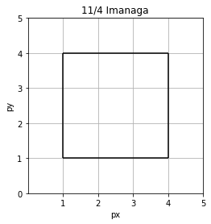
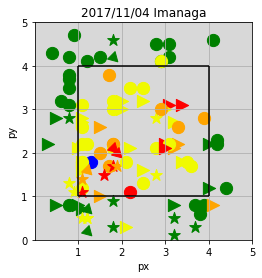

```python
import pandas as pd
import matplotlib.pyplot as plt
%matplotlib inline
```


```python
# figure settings
fig = plt.figure()
ax = fig.add_subplot(111,aspect='equal')
ax.set_title('11/4 Imanaga')
ax.set_xlabel('px')
ax.set_xlim((0, 5))
ax.set_xticks((1,2,3,4,5))
ax.set_yticks((0,1,2,3,4,5))
ax.set_ylabel('py')
ax.set_ylim((0, 5))
ax.grid(True)

# Strike Zone
ax.vlines(1, ymin=1, ymax=4)
ax.vlines(4, ymin=1, ymax=4)
ax.hlines(1, xmin=1, xmax=4)
ax.hlines(4, xmin=1, xmax=4)


ax.legend()
```





```python
db = pd.read_csv('ImanagaEN.csv',index_col='pitch_num')
```


```python
db
```


<div>
<style scoped>
    .dataframe tbody tr th:only-of-type {
        vertical-align: middle;
    }

    .dataframe tbody tr th {
        vertical-align: top;
    }

    .dataframe thead th {
        text-align: right;
    }
</style>
<table border="1" class="dataframe">
  <thead>
    <tr style="text-align: right;">
      <th></th>
      <th>pitch_type</th>
      <th>pitch_speed(km/h)</th>
      <th>px</th>
      <th>py</th>
      <th>result</th>
      <th>batter_name</th>
      <th>inning</th>
    </tr>
    <tr>
      <th>pitch_num</th>
      <th></th>
      <th></th>
      <th></th>
      <th></th>
      <th></th>
      <th></th>
      <th></th>
    </tr>
  </thead>
  <tbody>
    <tr>
      <th>1</th>
      <td>FF</td>
      <td>141</td>
      <td>3.5</td>
      <td>1.8</td>
      <td>S</td>
      <td>柳田悠岐</td>
      <td>1</td>
    </tr>
    <tr>
      <th>2</th>
      <td>FF</td>
      <td>143</td>
      <td>0.8</td>
      <td>3.8</td>
      <td>B</td>
      <td>柳田悠岐</td>
      <td>1</td>
    </tr>
    <tr>
      <th>3</th>
      <td>FF</td>
      <td>144</td>
      <td>1.8</td>
      <td>2.2</td>
      <td>F</td>
      <td>柳田悠岐</td>
      <td>1</td>
    </tr>
    <tr>
      <th>4</th>
      <td>SL</td>
      <td>139</td>
      <td>4.0</td>
      <td>1.2</td>
      <td>B</td>
      <td>柳田悠岐</td>
      <td>1</td>
    </tr>
    <tr>
      <th>5</th>
      <td>SL</td>
      <td>137</td>
      <td>3.0</td>
      <td>2.2</td>
      <td>I</td>
      <td>柳田悠岐</td>
      <td>1</td>
    </tr>
    <tr>
      <th>6</th>
      <td>FF</td>
      <td>144</td>
      <td>0.8</td>
      <td>4.2</td>
      <td>B</td>
      <td>今宮健太</td>
      <td>1</td>
    </tr>
    <tr>
      <th>7</th>
      <td>FF</td>
      <td>144</td>
      <td>1.8</td>
      <td>2.1</td>
      <td>S</td>
      <td>今宮健太</td>
      <td>1</td>
    </tr>
    <tr>
      <th>8</th>
      <td>CH</td>
      <td>124</td>
      <td>2.8</td>
      <td>2.8</td>
      <td>S</td>
      <td>今宮健太</td>
      <td>1</td>
    </tr>
    <tr>
      <th>9</th>
      <td>FF</td>
      <td>145</td>
      <td>1.2</td>
      <td>2.2</td>
      <td>S</td>
      <td>今宮健太</td>
      <td>1</td>
    </tr>
    <tr>
      <th>10</th>
      <td>FF</td>
      <td>145</td>
      <td>2.5</td>
      <td>1.3</td>
      <td>S</td>
      <td>デスパイネ</td>
      <td>1</td>
    </tr>
    <tr>
      <th>11</th>
      <td>FF</td>
      <td>144</td>
      <td>1.7</td>
      <td>1.7</td>
      <td>F</td>
      <td>デスパイネ</td>
      <td>1</td>
    </tr>
    <tr>
      <th>12</th>
      <td>FF</td>
      <td>146</td>
      <td>0.6</td>
      <td>3.2</td>
      <td>B</td>
      <td>デスパイネ</td>
      <td>1</td>
    </tr>
    <tr>
      <th>13</th>
      <td>CH</td>
      <td>126</td>
      <td>1.2</td>
      <td>0.5</td>
      <td>S</td>
      <td>デスパイネ</td>
      <td>1</td>
    </tr>
    <tr>
      <th>14</th>
      <td>FF</td>
      <td>143</td>
      <td>1.7</td>
      <td>3.8</td>
      <td>F</td>
      <td>内川聖一</td>
      <td>2</td>
    </tr>
    <tr>
      <th>15</th>
      <td>FF</td>
      <td>143</td>
      <td>1.1</td>
      <td>1.8</td>
      <td>S</td>
      <td>内川聖一</td>
      <td>2</td>
    </tr>
    <tr>
      <th>16</th>
      <td>FF</td>
      <td>143</td>
      <td>1.8</td>
      <td>2.2</td>
      <td>F</td>
      <td>内川聖一</td>
      <td>2</td>
    </tr>
    <tr>
      <th>17</th>
      <td>FF</td>
      <td>142</td>
      <td>4.2</td>
      <td>2.3</td>
      <td>B</td>
      <td>内川聖一</td>
      <td>2</td>
    </tr>
    <tr>
      <th>18</th>
      <td>FF</td>
      <td>145</td>
      <td>2.2</td>
      <td>1.1</td>
      <td>I</td>
      <td>内川聖一</td>
      <td>2</td>
    </tr>
    <tr>
      <th>19</th>
      <td>CU</td>
      <td>111</td>
      <td>1.8</td>
      <td>4.2</td>
      <td>B</td>
      <td>中村晃</td>
      <td>2</td>
    </tr>
    <tr>
      <th>20</th>
      <td>SL</td>
      <td>136</td>
      <td>3.1</td>
      <td>3.1</td>
      <td>I</td>
      <td>中村晃</td>
      <td>2</td>
    </tr>
    <tr>
      <th>21</th>
      <td>FF</td>
      <td>143</td>
      <td>2.2</td>
      <td>3.5</td>
      <td>S</td>
      <td>松田宣浩</td>
      <td>2</td>
    </tr>
    <tr>
      <th>22</th>
      <td>FF</td>
      <td>143</td>
      <td>3.1</td>
      <td>4.2</td>
      <td>B</td>
      <td>松田宣浩</td>
      <td>2</td>
    </tr>
    <tr>
      <th>23</th>
      <td>FF</td>
      <td>146</td>
      <td>1.8</td>
      <td>3.2</td>
      <td>S</td>
      <td>松田宣浩</td>
      <td>2</td>
    </tr>
    <tr>
      <th>24</th>
      <td>FF</td>
      <td>145</td>
      <td>1.3</td>
      <td>1.8</td>
      <td>HR</td>
      <td>松田宣浩</td>
      <td>2</td>
    </tr>
    <tr>
      <th>25</th>
      <td>CU</td>
      <td>112</td>
      <td>1.2</td>
      <td>0.2</td>
      <td>B</td>
      <td>川島慶三</td>
      <td>2</td>
    </tr>
    <tr>
      <th>26</th>
      <td>SL</td>
      <td>136</td>
      <td>2.5</td>
      <td>3.2</td>
      <td>S</td>
      <td>川島慶三</td>
      <td>2</td>
    </tr>
    <tr>
      <th>27</th>
      <td>SL</td>
      <td>132</td>
      <td>1.1</td>
      <td>0.7</td>
      <td>B</td>
      <td>川島慶三</td>
      <td>2</td>
    </tr>
    <tr>
      <th>28</th>
      <td>SL</td>
      <td>134</td>
      <td>1.1</td>
      <td>1.8</td>
      <td>S</td>
      <td>川島慶三</td>
      <td>2</td>
    </tr>
    <tr>
      <th>29</th>
      <td>FF</td>
      <td>145</td>
      <td>1.1</td>
      <td>2.2</td>
      <td>S</td>
      <td>川島慶三</td>
      <td>2</td>
    </tr>
    <tr>
      <th>30</th>
      <td>SL</td>
      <td>134</td>
      <td>0.5</td>
      <td>2.8</td>
      <td>B</td>
      <td>長谷川勇也</td>
      <td>3</td>
    </tr>
    <tr>
      <th>...</th>
      <td>...</td>
      <td>...</td>
      <td>...</td>
      <td>...</td>
      <td>...</td>
      <td>...</td>
      <td>...</td>
    </tr>
    <tr>
      <th>78</th>
      <td>FF</td>
      <td>142</td>
      <td>1.5</td>
      <td>2.0</td>
      <td>F</td>
      <td>甲斐拓也</td>
      <td>6</td>
    </tr>
    <tr>
      <th>79</th>
      <td>FF</td>
      <td>145</td>
      <td>0.8</td>
      <td>3.5</td>
      <td>B</td>
      <td>甲斐拓也</td>
      <td>6</td>
    </tr>
    <tr>
      <th>80</th>
      <td>FF</td>
      <td>142</td>
      <td>2.9</td>
      <td>3.0</td>
      <td>F</td>
      <td>柳田悠岐</td>
      <td>6</td>
    </tr>
    <tr>
      <th>81</th>
      <td>FF</td>
      <td>142</td>
      <td>4.1</td>
      <td>4.6</td>
      <td>B</td>
      <td>柳田悠岐</td>
      <td>6</td>
    </tr>
    <tr>
      <th>82</th>
      <td>FF</td>
      <td>142</td>
      <td>2.9</td>
      <td>4.1</td>
      <td>S</td>
      <td>柳田悠岐</td>
      <td>6</td>
    </tr>
    <tr>
      <th>83</th>
      <td>FF</td>
      <td>145</td>
      <td>3.3</td>
      <td>2.6</td>
      <td>F</td>
      <td>柳田悠岐</td>
      <td>6</td>
    </tr>
    <tr>
      <th>84</th>
      <td>FF</td>
      <td>143</td>
      <td>4.2</td>
      <td>2.2</td>
      <td>B</td>
      <td>柳田悠岐</td>
      <td>6</td>
    </tr>
    <tr>
      <th>85</th>
      <td>SL</td>
      <td>136</td>
      <td>4.1</td>
      <td>0.8</td>
      <td>F</td>
      <td>柳田悠岐</td>
      <td>6</td>
    </tr>
    <tr>
      <th>86</th>
      <td>FF</td>
      <td>145</td>
      <td>2.8</td>
      <td>4.5</td>
      <td>B</td>
      <td>柳田悠岐</td>
      <td>6</td>
    </tr>
    <tr>
      <th>87</th>
      <td>SL</td>
      <td>133</td>
      <td>2.0</td>
      <td>3.0</td>
      <td>S</td>
      <td>柳田悠岐</td>
      <td>6</td>
    </tr>
    <tr>
      <th>88</th>
      <td>FF</td>
      <td>144</td>
      <td>1.2</td>
      <td>4.1</td>
      <td>B</td>
      <td>柳田悠岐</td>
      <td>6</td>
    </tr>
    <tr>
      <th>89</th>
      <td>CH</td>
      <td>125</td>
      <td>1.1</td>
      <td>1.1</td>
      <td>I</td>
      <td>今宮健太</td>
      <td>6</td>
    </tr>
    <tr>
      <th>90</th>
      <td>CU</td>
      <td>112</td>
      <td>1.2</td>
      <td>1.6</td>
      <td>F</td>
      <td>デスパイネ</td>
      <td>6</td>
    </tr>
    <tr>
      <th>91</th>
      <td>FF</td>
      <td>139</td>
      <td>0.9</td>
      <td>4.7</td>
      <td>B</td>
      <td>デスパイネ</td>
      <td>6</td>
    </tr>
    <tr>
      <th>92</th>
      <td>CU</td>
      <td>113</td>
      <td>1.8</td>
      <td>2.1</td>
      <td>I</td>
      <td>デスパイネ</td>
      <td>6</td>
    </tr>
    <tr>
      <th>93</th>
      <td>FF</td>
      <td>140</td>
      <td>2.1</td>
      <td>1.8</td>
      <td>S</td>
      <td>内川聖一</td>
      <td>7</td>
    </tr>
    <tr>
      <th>94</th>
      <td>SL</td>
      <td>130</td>
      <td>1.5</td>
      <td>1.0</td>
      <td>F</td>
      <td>内川聖一</td>
      <td>7</td>
    </tr>
    <tr>
      <th>95</th>
      <td>CH</td>
      <td>127</td>
      <td>0.9</td>
      <td>1.1</td>
      <td>S</td>
      <td>内川聖一</td>
      <td>7</td>
    </tr>
    <tr>
      <th>96</th>
      <td>CU</td>
      <td>110</td>
      <td>1.2</td>
      <td>0.7</td>
      <td>B</td>
      <td>中村晃</td>
      <td>7</td>
    </tr>
    <tr>
      <th>97</th>
      <td>SL</td>
      <td>134</td>
      <td>0.5</td>
      <td>0.8</td>
      <td>B</td>
      <td>中村晃</td>
      <td>7</td>
    </tr>
    <tr>
      <th>98</th>
      <td>FF</td>
      <td>140</td>
      <td>3.8</td>
      <td>0.6</td>
      <td>B</td>
      <td>中村晃</td>
      <td>7</td>
    </tr>
    <tr>
      <th>99</th>
      <td>FF</td>
      <td>140</td>
      <td>2.5</td>
      <td>3.5</td>
      <td>S</td>
      <td>中村晃</td>
      <td>7</td>
    </tr>
    <tr>
      <th>100</th>
      <td>FF</td>
      <td>139</td>
      <td>3.6</td>
      <td>1.7</td>
      <td>S</td>
      <td>中村晃</td>
      <td>7</td>
    </tr>
    <tr>
      <th>101</th>
      <td>SL</td>
      <td>135</td>
      <td>2.1</td>
      <td>0.3</td>
      <td>S</td>
      <td>中村晃</td>
      <td>7</td>
    </tr>
    <tr>
      <th>102</th>
      <td>SL</td>
      <td>134</td>
      <td>0.3</td>
      <td>2.2</td>
      <td>B</td>
      <td>松田宣浩</td>
      <td>7</td>
    </tr>
    <tr>
      <th>103</th>
      <td>SL</td>
      <td>136</td>
      <td>1.1</td>
      <td>2.8</td>
      <td>S</td>
      <td>松田宣浩</td>
      <td>7</td>
    </tr>
    <tr>
      <th>104</th>
      <td>CH</td>
      <td>126</td>
      <td>1.8</td>
      <td>0.9</td>
      <td>B</td>
      <td>松田宣浩</td>
      <td>7</td>
    </tr>
    <tr>
      <th>105</th>
      <td>CH</td>
      <td>126</td>
      <td>3.7</td>
      <td>0.3</td>
      <td>B</td>
      <td>松田宣浩</td>
      <td>7</td>
    </tr>
    <tr>
      <th>106</th>
      <td>CH</td>
      <td>126</td>
      <td>1.8</td>
      <td>4.6</td>
      <td>B</td>
      <td>松田宣浩</td>
      <td>7</td>
    </tr>
    <tr>
      <th>107</th>
      <td>SL</td>
      <td>133</td>
      <td>3.0</td>
      <td>2.1</td>
      <td>I</td>
      <td>川島慶三</td>
      <td>7</td>
    </tr>
  </tbody>
</table>
<p>107 rows × 7 columns</p>
</div>


```python
# color & marker

def get_color(pitch_res):
    # retrosheet_events
    if pitch_res == 'S':
        return '#F0FA01'
    elif pitch_res == 'F':
        return 'orange'
    elif pitch_res == 'B':
        return 'green'
    elif pitch_res == 'I':
        return 'red'
    return 'blue'

def get_marker(pitch_type,LR='R'):
    # retrosheet_events
    if pitch_type in ('FF', 'TF'):
        return 'o'
    elif pitch_type in ('CU'):
        if LR == 'R':
            return (3,0,135)
        else:
            return (3,0,225)
    elif pitch_type in ('SL'):
        if LR == 'R':
            return '<'
        else:
            return '>'
    elif pitch_type in ('FT'):
        if LR == 'R':
            return '>'
        else:
            return '<'
    elif pitch_type in ('SI'):
        if LR == 'R':
            return (3,0,225)
        else:
            return (3,0,135)
    elif pitch_type in ('FK','SP'):
        return 'v'
    return '*'

# figure settings
fig = plt.figure()
#fig.patch.set_facecolor('black')
ax = fig.add_subplot(111,aspect='equal')
ax.patch.set_facecolor('grey')
ax.patch.set_alpha(0.3)
ax.set_title('2017/11/04 Imanaga')
ax.set_xlabel('px')
ax.set_xlim((0, 5))
ax.set_xticks((1,2,3,4,5))
ax.set_yticks((0,1,2,3,4,5))
ax.set_ylabel('py')
ax.set_ylim((0, 5))
ax.grid(True)

# Strike Zone
ax.vlines(1, ymin=1, ymax=4)
ax.vlines(4, ymin=1, ymax=4)
ax.hlines(1, xmin=1, xmax=4)
ax.hlines(4, xmin=1, xmax=4)
# pitched
i = 1
for _, pitch in db.iterrows():
    c = get_color(pitch['result'])
    # print(get_color('B'))
    marker = get_marker(pitch['pitch_type'],'L')
    ax.scatter(pitch['px'], pitch['py'],s=150, c=c, marker=marker)
    i += 1

ax.legend()

```




