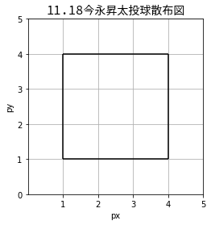
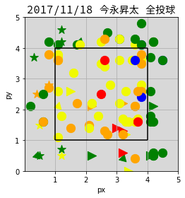

```python
import os
import numpy as np
import pandas as pd
from matplotlib import pyplot as plt, font_manager
%matplotlib inline

# フォントキャッシュを再構築します。
font_manager._rebuild()

if os.name == 'posix':
    # OSがbash in windowsの場合、win32FontDirectory()利用できます。
    font_dir = '/mnt/c/Windows/Fonts'
else:
    # MAC
    font_dir = '/Users/pydata/Library/Fonts/'
font_path = os.path.join(font_dir,'SourceHanCodeJP-Regular.otf')
font = font_manager.FontProperties(fname=font_path,size=14)

# figure settings
fig = plt.figure()
ax = fig.add_subplot(111,aspect='equal')
ax.set_title('11.18今永昇太投球散布図',fontproperties=font)
ax.set_xlabel('px')
ax.set_xlim((0, 5))
ax.set_xticks((1,2,3,4,5))
ax.set_yticks((0,1,2,3,4,5))
ax.set_ylabel('py')
ax.set_ylim((0, 5))
ax.grid(True)

# Strike Zone
ax.vlines(1, ymin=1, ymax=4)
ax.vlines(4, ymin=1, ymax=4)
ax.hlines(1, xmin=1, xmax=4)
ax.hlines(4, xmin=1, xmax=4)


ax.legend()

```





```python
db = pd.read_csv('ImanagaEN.csv',index_col='pitch_num')
# color & marker

def get_color(pitch_res):
    # retrosheet_events
    if pitch_res == 'S':
        return '#F0FA01'
    elif pitch_res == 'F':
        return 'orange'
    elif pitch_res == 'B':
        return 'green'
    elif pitch_res == 'I':
        return 'red'
    return 'blue'

def get_marker(pitch_type,LR='R'):
    # retrosheet_events
    if pitch_type in ('FF', 'TF'):
        return 'o'
    elif pitch_type in ('CU'):
        if LR == 'R':
            return (3,0,135)
        else:
            return (3,0,225)
    elif pitch_type in ('SL'):
        if LR == 'R':
            return '<'
        else:
            return '>'
    elif pitch_type in ('FT'):
        if LR == 'R':
            return '>'
        else:
            return '<'
    elif pitch_type in ('SI'):
        if LR == 'R':
            return (3,0,225)
        else:
            return (3,0,135)
    elif pitch_type in ('FK','SP'):
        return 'v'
    return '*'
# figure settings
fig = plt.figure()
#fig.patch.set_facecolor('black')
ax = fig.add_subplot(111,aspect='equal')
ax.patch.set_facecolor('grey')
ax.patch.set_alpha(0.3)
ax.set_title('2017/11/18 今永昇太 全投球',fontproperties=font)
ax.set_xlabel('px')
ax.set_xlim((0, 5))
ax.set_xticks((1,2,3,4,5))
ax.set_yticks((0,1,2,3,4,5))
ax.set_ylabel('py')
ax.set_ylim((0, 5))
ax.grid(True)

# Strike Zone
ax.vlines(1, ymin=1, ymax=4)
ax.vlines(4, ymin=1, ymax=4)
ax.hlines(1, xmin=1, xmax=4)
ax.hlines(4, xmin=1, xmax=4)
# pitched
i = 1
for _, pitch in db.iterrows():
    c = get_color(pitch['result'])
    # print(get_color('B'))
    marker = get_marker(pitch['pitch_type'],'L')
    ax.scatter(pitch['px'], pitch['py'],s=150, c=c, marker=marker)
    i += 1
ax.legend()
```




