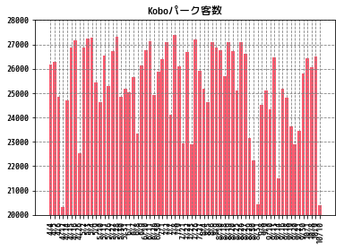

```python
import csv


csvfile = open('Schedule_E_2017.csv','rb')
lines = csvfile.readlines()
# for l in lines:
#     print (l.decode('shift_jis'))
        
```


```python
import pandas as pd

df = pd.read_csv('Schedule_E_2017.csv',encoding='shift_jis')
# df
```


```python
# df.info()
```


```python
grouped = df.groupby('球場')
```


```python
# Koboパーク宮城の行を選出    NaN削除
home = df[df.球場=='Koboパーク宮城'].dropna(how='any')
```


```python
%matplotlib
import matplotlib
import matplotlib.pyplot as plt
import seaborn as sns
# font = {'family': 'Rounded Mgen+ 1m medium'}
# matplotlib.rc('font',**font)
```

    Using matplotlib backend: TkAgg


```python
import datetime as dt
date = list()
for d in list(home['日時']):
#     temp = dt.datetime.strptime(d,'%m/%d')
#     temp = temp.replace(year = 2017)
    date.append(d)
date
```


    ['4/4',
     '4/5',
     '4/6',
     '4/12',
     '4/14',
     '4/15',
     '4/16',
     '4/26',
     '5/2',
     '5/3',
     '5/4',
     '5/9',
     '5/10',
     '5/11',
     '5/26',
     '5/27',
     '5/28',
     '5/30',
     '5/31',
     '6/1',
     '6/7',
     '6/8',
     '6/9',
     '6/10',
     '6/11',
     '6/26',
     '6/30',
     '7/1',
     '7/2',
     '7/7',
     '7/8',
     '7/9',
     '7/21',
     '7/22',
     '7/23',
     '7/26',
     '7/27',
     '8/4',
     '8/5',
     '8/6',
     '8/9',
     '8/10',
     '8/18',
     '8/19',
     '8/20',
     '8/25',
     '8/26',
     '8/27',
     '8/29',
     '8/30',
     '8/31',
     '9/8',
     '9/9',
     '9/10',
     '9/13',
     '9/14',
     '9/16',
     '9/18',
     '9/19',
     '9/20',
     '9/21',
     '9/30',
     '10/1',
     '10/8',
     '10/9',
     '10/10']


```python
home
```


<div>
<style scoped>
    .dataframe tbody tr th:only-of-type {
        vertical-align: middle;
    }

    .dataframe tbody tr th {
        vertical-align: top;
    }

    .dataframe thead th {
        text-align: right;
    }
</style>
<table border="1" class="dataframe">
  <thead>
    <tr style="text-align: right;">
      <th></th>
      <th>日時</th>
      <th>曜日</th>
      <th>相手</th>
      <th>球場</th>
      <th>開始</th>
      <th>観衆</th>
      <th>勝敗</th>
      <th>得</th>
      <th>失</th>
      <th>打数</th>
      <th>...</th>
      <th>攻撃</th>
      <th>回数</th>
      <th>被安</th>
      <th>被本</th>
      <th>四死球</th>
      <th>自責</th>
      <th>HA</th>
      <th>カ</th>
      <th>ナ</th>
      <th>サ</th>
    </tr>
  </thead>
  <tbody>
    <tr>
      <th>3</th>
      <td>4/4</td>
      <td>火</td>
      <td>ソフトバンク</td>
      <td>Koboパーク宮城</td>
      <td>16:00</td>
      <td>26162.0</td>
      <td>○</td>
      <td>7.0</td>
      <td>1.0</td>
      <td>29</td>
      <td>...</td>
      <td>8</td>
      <td>9</td>
      <td>7</td>
      <td>0</td>
      <td>4</td>
      <td>1</td>
      <td>0</td>
      <td>2</td>
      <td>0</td>
      <td>-</td>
    </tr>
    <tr>
      <th>4</th>
      <td>4/5</td>
      <td>水</td>
      <td>ソフトバンク</td>
      <td>Koboパーク宮城</td>
      <td>13:00</td>
      <td>26298.0</td>
      <td>●</td>
      <td>4.0</td>
      <td>15.0</td>
      <td>33</td>
      <td>...</td>
      <td>9</td>
      <td>9</td>
      <td>16</td>
      <td>1</td>
      <td>8</td>
      <td>15</td>
      <td>0</td>
      <td>2</td>
      <td>0</td>
      <td>-</td>
    </tr>
    <tr>
      <th>5</th>
      <td>4/6</td>
      <td>木</td>
      <td>ソフトバンク</td>
      <td>Koboパーク宮城</td>
      <td>13:00</td>
      <td>24841.0</td>
      <td>○</td>
      <td>3.0</td>
      <td>1.0</td>
      <td>28</td>
      <td>...</td>
      <td>8</td>
      <td>9</td>
      <td>3</td>
      <td>0</td>
      <td>7</td>
      <td>0</td>
      <td>0</td>
      <td>2</td>
      <td>0</td>
      <td>-</td>
    </tr>
    <tr>
      <th>9</th>
      <td>4/12</td>
      <td>水</td>
      <td>西武</td>
      <td>Koboパーク宮城</td>
      <td>16:00</td>
      <td>20329.0</td>
      <td>●</td>
      <td>5.0</td>
      <td>10.0</td>
      <td>38</td>
      <td>...</td>
      <td>9</td>
      <td>9</td>
      <td>15</td>
      <td>2</td>
      <td>8</td>
      <td>10</td>
      <td>0</td>
      <td>4</td>
      <td>0</td>
      <td>-</td>
    </tr>
    <tr>
      <th>10</th>
      <td>4/14</td>
      <td>金</td>
      <td>日本ハム</td>
      <td>Koboパーク宮城</td>
      <td>18:00</td>
      <td>24714.0</td>
      <td>○</td>
      <td>3.0</td>
      <td>2.0</td>
      <td>37</td>
      <td>...</td>
      <td>8</td>
      <td>9</td>
      <td>5</td>
      <td>2</td>
      <td>6</td>
      <td>2</td>
      <td>0</td>
      <td>5</td>
      <td>1</td>
      <td>-</td>
    </tr>
    <tr>
      <th>11</th>
      <td>4/15</td>
      <td>土</td>
      <td>日本ハム</td>
      <td>Koboパーク宮城</td>
      <td>14:00</td>
      <td>26856.0</td>
      <td>○</td>
      <td>4.0</td>
      <td>2.0</td>
      <td>34</td>
      <td>...</td>
      <td>8</td>
      <td>9</td>
      <td>6</td>
      <td>2</td>
      <td>1</td>
      <td>2</td>
      <td>0</td>
      <td>5</td>
      <td>0</td>
      <td>-</td>
    </tr>
    <tr>
      <th>12</th>
      <td>4/16</td>
      <td>日</td>
      <td>日本ハム</td>
      <td>Koboパーク宮城</td>
      <td>13:00</td>
      <td>27165.0</td>
      <td>○</td>
      <td>4.0</td>
      <td>3.0</td>
      <td>38</td>
      <td>...</td>
      <td>10</td>
      <td>10</td>
      <td>10</td>
      <td>2</td>
      <td>3</td>
      <td>3</td>
      <td>0</td>
      <td>5</td>
      <td>0</td>
      <td>-</td>
    </tr>
    <tr>
      <th>19</th>
      <td>4/26</td>
      <td>水</td>
      <td>ロッテ</td>
      <td>Koboパーク宮城</td>
      <td>18:00</td>
      <td>22519.0</td>
      <td>○</td>
      <td>11.0</td>
      <td>7.0</td>
      <td>34</td>
      <td>...</td>
      <td>8</td>
      <td>9</td>
      <td>12</td>
      <td>0</td>
      <td>2</td>
      <td>2</td>
      <td>0</td>
      <td>8</td>
      <td>1</td>
      <td>-</td>
    </tr>
    <tr>
      <th>22</th>
      <td>5/2</td>
      <td>火</td>
      <td>オリックス</td>
      <td>Koboパーク宮城</td>
      <td>18:00</td>
      <td>26890.0</td>
      <td>●</td>
      <td>1.0</td>
      <td>4.0</td>
      <td>30</td>
      <td>...</td>
      <td>9</td>
      <td>9</td>
      <td>8</td>
      <td>2</td>
      <td>2</td>
      <td>4</td>
      <td>0</td>
      <td>10</td>
      <td>1</td>
      <td>-</td>
    </tr>
    <tr>
      <th>23</th>
      <td>5/3</td>
      <td>水</td>
      <td>オリックス</td>
      <td>Koboパーク宮城</td>
      <td>14:00</td>
      <td>27259.0</td>
      <td>○</td>
      <td>4.0</td>
      <td>2.0</td>
      <td>29</td>
      <td>...</td>
      <td>8</td>
      <td>9</td>
      <td>7</td>
      <td>1</td>
      <td>3</td>
      <td>2</td>
      <td>0</td>
      <td>10</td>
      <td>0</td>
      <td>-</td>
    </tr>
    <tr>
      <th>24</th>
      <td>5/4</td>
      <td>木</td>
      <td>オリックス</td>
      <td>Koboパーク宮城</td>
      <td>13:00</td>
      <td>27294.0</td>
      <td>○</td>
      <td>2.0</td>
      <td>1.0</td>
      <td>25</td>
      <td>...</td>
      <td>8</td>
      <td>9</td>
      <td>7</td>
      <td>0</td>
      <td>3</td>
      <td>1</td>
      <td>0</td>
      <td>10</td>
      <td>0</td>
      <td>-</td>
    </tr>
    <tr>
      <th>28</th>
      <td>5/9</td>
      <td>火</td>
      <td>ロッテ</td>
      <td>Koboパーク宮城</td>
      <td>13:00</td>
      <td>25451.0</td>
      <td>●</td>
      <td>4.0</td>
      <td>6.0</td>
      <td>36</td>
      <td>...</td>
      <td>9</td>
      <td>9</td>
      <td>8</td>
      <td>1</td>
      <td>5</td>
      <td>6</td>
      <td>0</td>
      <td>12</td>
      <td>0</td>
      <td>-</td>
    </tr>
    <tr>
      <th>29</th>
      <td>5/10</td>
      <td>水</td>
      <td>ロッテ</td>
      <td>Koboパーク宮城</td>
      <td>18:00</td>
      <td>24628.0</td>
      <td>○</td>
      <td>5.0</td>
      <td>0.0</td>
      <td>28</td>
      <td>...</td>
      <td>8</td>
      <td>9</td>
      <td>5</td>
      <td>0</td>
      <td>1</td>
      <td>0</td>
      <td>0</td>
      <td>12</td>
      <td>1</td>
      <td>-</td>
    </tr>
    <tr>
      <th>30</th>
      <td>5/11</td>
      <td>木</td>
      <td>ロッテ</td>
      <td>Koboパーク宮城</td>
      <td>18:00</td>
      <td>26547.0</td>
      <td>○</td>
      <td>4.0</td>
      <td>1.0</td>
      <td>27</td>
      <td>...</td>
      <td>8</td>
      <td>9</td>
      <td>8</td>
      <td>1</td>
      <td>3</td>
      <td>1</td>
      <td>0</td>
      <td>12</td>
      <td>1</td>
      <td>-</td>
    </tr>
    <tr>
      <th>41</th>
      <td>5/26</td>
      <td>金</td>
      <td>西武</td>
      <td>Koboパーク宮城</td>
      <td>18:00</td>
      <td>25297.0</td>
      <td>●</td>
      <td>1.0</td>
      <td>5.0</td>
      <td>32</td>
      <td>...</td>
      <td>9</td>
      <td>9</td>
      <td>7</td>
      <td>0</td>
      <td>3</td>
      <td>5</td>
      <td>0</td>
      <td>17</td>
      <td>1</td>
      <td>-</td>
    </tr>
    <tr>
      <th>42</th>
      <td>5/27</td>
      <td>土</td>
      <td>西武</td>
      <td>Koboパーク宮城</td>
      <td>14:00</td>
      <td>26709.0</td>
      <td>○</td>
      <td>6.0</td>
      <td>1.0</td>
      <td>30</td>
      <td>...</td>
      <td>8</td>
      <td>9</td>
      <td>7</td>
      <td>1</td>
      <td>0</td>
      <td>1</td>
      <td>0</td>
      <td>17</td>
      <td>0</td>
      <td>-</td>
    </tr>
    <tr>
      <th>43</th>
      <td>5/28</td>
      <td>日</td>
      <td>西武</td>
      <td>Koboパーク宮城</td>
      <td>13:00</td>
      <td>27314.0</td>
      <td>○</td>
      <td>13.0</td>
      <td>2.0</td>
      <td>37</td>
      <td>...</td>
      <td>8</td>
      <td>9</td>
      <td>5</td>
      <td>1</td>
      <td>3</td>
      <td>2</td>
      <td>0</td>
      <td>17</td>
      <td>0</td>
      <td>-</td>
    </tr>
    <tr>
      <th>44</th>
      <td>5/30</td>
      <td>火</td>
      <td>巨人</td>
      <td>Koboパーク宮城</td>
      <td>18:00</td>
      <td>24855.0</td>
      <td>○</td>
      <td>13.0</td>
      <td>5.0</td>
      <td>39</td>
      <td>...</td>
      <td>8</td>
      <td>9</td>
      <td>13</td>
      <td>0</td>
      <td>2</td>
      <td>4</td>
      <td>0</td>
      <td>18</td>
      <td>1</td>
      <td>-</td>
    </tr>
    <tr>
      <th>45</th>
      <td>5/31</td>
      <td>水</td>
      <td>巨人</td>
      <td>Koboパーク宮城</td>
      <td>18:00</td>
      <td>25193.0</td>
      <td>○</td>
      <td>6.0</td>
      <td>0.0</td>
      <td>31</td>
      <td>...</td>
      <td>8</td>
      <td>9</td>
      <td>5</td>
      <td>0</td>
      <td>3</td>
      <td>0</td>
      <td>0</td>
      <td>18</td>
      <td>1</td>
      <td>-</td>
    </tr>
    <tr>
      <th>46</th>
      <td>6/1</td>
      <td>木</td>
      <td>巨人</td>
      <td>Koboパーク宮城</td>
      <td>18:00</td>
      <td>25040.0</td>
      <td>○</td>
      <td>3.0</td>
      <td>2.0</td>
      <td>31</td>
      <td>...</td>
      <td>8</td>
      <td>9</td>
      <td>7</td>
      <td>1</td>
      <td>2</td>
      <td>2</td>
      <td>0</td>
      <td>18</td>
      <td>1</td>
      <td>-</td>
    </tr>
    <tr>
      <th>51</th>
      <td>6/7</td>
      <td>水</td>
      <td>ＤｅＮＡ</td>
      <td>Koboパーク宮城</td>
      <td>18:00</td>
      <td>25653.0</td>
      <td>●</td>
      <td>6.0</td>
      <td>10.0</td>
      <td>35</td>
      <td>...</td>
      <td>9</td>
      <td>9</td>
      <td>12</td>
      <td>0</td>
      <td>12</td>
      <td>7</td>
      <td>0</td>
      <td>20</td>
      <td>1</td>
      <td>-</td>
    </tr>
    <tr>
      <th>52</th>
      <td>6/8</td>
      <td>木</td>
      <td>ＤｅＮＡ</td>
      <td>Koboパーク宮城</td>
      <td>18:00</td>
      <td>23328.0</td>
      <td>○</td>
      <td>8.0</td>
      <td>2.0</td>
      <td>34</td>
      <td>...</td>
      <td>8</td>
      <td>9</td>
      <td>7</td>
      <td>1</td>
      <td>1</td>
      <td>2</td>
      <td>0</td>
      <td>20</td>
      <td>1</td>
      <td>-</td>
    </tr>
    <tr>
      <th>53</th>
      <td>6/9</td>
      <td>金</td>
      <td>広島</td>
      <td>Koboパーク宮城</td>
      <td>18:00</td>
      <td>26137.0</td>
      <td>●</td>
      <td>3.0</td>
      <td>12.0</td>
      <td>37</td>
      <td>...</td>
      <td>9</td>
      <td>9</td>
      <td>16</td>
      <td>0</td>
      <td>6</td>
      <td>12</td>
      <td>0</td>
      <td>21</td>
      <td>1</td>
      <td>-</td>
    </tr>
    <tr>
      <th>54</th>
      <td>6/10</td>
      <td>土</td>
      <td>広島</td>
      <td>Koboパーク宮城</td>
      <td>14:00</td>
      <td>26772.0</td>
      <td>○</td>
      <td>2.0</td>
      <td>1.0</td>
      <td>30</td>
      <td>...</td>
      <td>8</td>
      <td>9</td>
      <td>4</td>
      <td>0</td>
      <td>2</td>
      <td>1</td>
      <td>0</td>
      <td>21</td>
      <td>0</td>
      <td>-</td>
    </tr>
    <tr>
      <th>55</th>
      <td>6/11</td>
      <td>日</td>
      <td>広島</td>
      <td>Koboパーク宮城</td>
      <td>13:00</td>
      <td>27146.0</td>
      <td>○</td>
      <td>4.0</td>
      <td>3.0</td>
      <td>26</td>
      <td>...</td>
      <td>8</td>
      <td>9</td>
      <td>7</td>
      <td>1</td>
      <td>4</td>
      <td>3</td>
      <td>0</td>
      <td>21</td>
      <td>0</td>
      <td>-</td>
    </tr>
    <tr>
      <th>65</th>
      <td>6/26</td>
      <td>月</td>
      <td>オリックス</td>
      <td>Koboパーク宮城</td>
      <td>18:00</td>
      <td>24931.0</td>
      <td>△</td>
      <td>4.0</td>
      <td>4.0</td>
      <td>45</td>
      <td>...</td>
      <td>12</td>
      <td>12</td>
      <td>10</td>
      <td>1</td>
      <td>1</td>
      <td>4</td>
      <td>0</td>
      <td>25</td>
      <td>1</td>
      <td>-</td>
    </tr>
    <tr>
      <th>67</th>
      <td>6/30</td>
      <td>金</td>
      <td>ソフトバンク</td>
      <td>Koboパーク宮城</td>
      <td>18:00</td>
      <td>25872.0</td>
      <td>○</td>
      <td>4.0</td>
      <td>3.0</td>
      <td>27</td>
      <td>...</td>
      <td>8</td>
      <td>9</td>
      <td>11</td>
      <td>1</td>
      <td>4</td>
      <td>3</td>
      <td>0</td>
      <td>26</td>
      <td>1</td>
      <td>-</td>
    </tr>
    <tr>
      <th>68</th>
      <td>7/1</td>
      <td>土</td>
      <td>ソフトバンク</td>
      <td>Koboパーク宮城</td>
      <td>14:00</td>
      <td>26383.0</td>
      <td>●</td>
      <td>9.0</td>
      <td>10.0</td>
      <td>36</td>
      <td>...</td>
      <td>9</td>
      <td>9</td>
      <td>16</td>
      <td>2</td>
      <td>2</td>
      <td>10</td>
      <td>0</td>
      <td>26</td>
      <td>0</td>
      <td>-</td>
    </tr>
    <tr>
      <th>69</th>
      <td>7/2</td>
      <td>日</td>
      <td>ソフトバンク</td>
      <td>Koboパーク宮城</td>
      <td>13:00</td>
      <td>27084.0</td>
      <td>●</td>
      <td>4.0</td>
      <td>5.0</td>
      <td>33</td>
      <td>...</td>
      <td>9</td>
      <td>9</td>
      <td>8</td>
      <td>1</td>
      <td>5</td>
      <td>4</td>
      <td>0</td>
      <td>26</td>
      <td>0</td>
      <td>-</td>
    </tr>
    <tr>
      <th>72</th>
      <td>7/7</td>
      <td>金</td>
      <td>西武</td>
      <td>Koboパーク宮城</td>
      <td>18:00</td>
      <td>24106.0</td>
      <td>●</td>
      <td>0.0</td>
      <td>5.0</td>
      <td>33</td>
      <td>...</td>
      <td>9</td>
      <td>9</td>
      <td>9</td>
      <td>0</td>
      <td>4</td>
      <td>4</td>
      <td>0</td>
      <td>28</td>
      <td>1</td>
      <td>-</td>
    </tr>
    <tr>
      <th>...</th>
      <td>...</td>
      <td>...</td>
      <td>...</td>
      <td>...</td>
      <td>...</td>
      <td>...</td>
      <td>...</td>
      <td>...</td>
      <td>...</td>
      <td>...</td>
      <td>...</td>
      <td>...</td>
      <td>...</td>
      <td>...</td>
      <td>...</td>
      <td>...</td>
      <td>...</td>
      <td>...</td>
      <td>...</td>
      <td>...</td>
      <td>...</td>
    </tr>
    <tr>
      <th>85</th>
      <td>7/27</td>
      <td>木</td>
      <td>ソフトバンク</td>
      <td>Koboパーク宮城</td>
      <td>14:00</td>
      <td>25913.0</td>
      <td>●</td>
      <td>1.0</td>
      <td>5.0</td>
      <td>31</td>
      <td>...</td>
      <td>9</td>
      <td>9</td>
      <td>10</td>
      <td>0</td>
      <td>3</td>
      <td>5</td>
      <td>0</td>
      <td>32</td>
      <td>0</td>
      <td>-</td>
    </tr>
    <tr>
      <th>92</th>
      <td>8/4</td>
      <td>金</td>
      <td>ロッテ</td>
      <td>Koboパーク宮城</td>
      <td>18:00</td>
      <td>25171.0</td>
      <td>○</td>
      <td>3.0</td>
      <td>2.0</td>
      <td>29</td>
      <td>...</td>
      <td>9</td>
      <td>9</td>
      <td>5</td>
      <td>1</td>
      <td>2</td>
      <td>2</td>
      <td>0</td>
      <td>35</td>
      <td>1</td>
      <td>-</td>
    </tr>
    <tr>
      <th>93</th>
      <td>8/5</td>
      <td>土</td>
      <td>ロッテ</td>
      <td>Koboパーク宮城</td>
      <td>18:00</td>
      <td>24622.0</td>
      <td>○</td>
      <td>8.0</td>
      <td>5.0</td>
      <td>38</td>
      <td>...</td>
      <td>8</td>
      <td>9</td>
      <td>12</td>
      <td>2</td>
      <td>4</td>
      <td>5</td>
      <td>0</td>
      <td>35</td>
      <td>1</td>
      <td>-</td>
    </tr>
    <tr>
      <th>94</th>
      <td>8/6</td>
      <td>日</td>
      <td>ロッテ</td>
      <td>Koboパーク宮城</td>
      <td>17:00</td>
      <td>27093.0</td>
      <td>●</td>
      <td>1.0</td>
      <td>3.0</td>
      <td>31</td>
      <td>...</td>
      <td>9</td>
      <td>9</td>
      <td>6</td>
      <td>0</td>
      <td>5</td>
      <td>3</td>
      <td>0</td>
      <td>35</td>
      <td>1</td>
      <td>-</td>
    </tr>
    <tr>
      <th>96</th>
      <td>8/9</td>
      <td>水</td>
      <td>日本ハム</td>
      <td>Koboパーク宮城</td>
      <td>18:00</td>
      <td>26886.0</td>
      <td>○</td>
      <td>6.0</td>
      <td>5.0</td>
      <td>30</td>
      <td>...</td>
      <td>8</td>
      <td>9</td>
      <td>12</td>
      <td>1</td>
      <td>3</td>
      <td>5</td>
      <td>0</td>
      <td>36</td>
      <td>1</td>
      <td>-</td>
    </tr>
    <tr>
      <th>97</th>
      <td>8/10</td>
      <td>木</td>
      <td>日本ハム</td>
      <td>Koboパーク宮城</td>
      <td>18:00</td>
      <td>26745.0</td>
      <td>○</td>
      <td>4.0</td>
      <td>3.0</td>
      <td>40</td>
      <td>...</td>
      <td>11</td>
      <td>11</td>
      <td>11</td>
      <td>1</td>
      <td>6</td>
      <td>3</td>
      <td>0</td>
      <td>36</td>
      <td>1</td>
      <td>-</td>
    </tr>
    <tr>
      <th>104</th>
      <td>8/18</td>
      <td>金</td>
      <td>ソフトバンク</td>
      <td>Koboパーク宮城</td>
      <td>18:00</td>
      <td>25694.0</td>
      <td>●</td>
      <td>1.0</td>
      <td>4.0</td>
      <td>30</td>
      <td>...</td>
      <td>9</td>
      <td>9</td>
      <td>8</td>
      <td>3</td>
      <td>1</td>
      <td>4</td>
      <td>0</td>
      <td>39</td>
      <td>1</td>
      <td>-</td>
    </tr>
    <tr>
      <th>105</th>
      <td>8/19</td>
      <td>土</td>
      <td>ソフトバンク</td>
      <td>Koboパーク宮城</td>
      <td>18:00</td>
      <td>27111.0</td>
      <td>●</td>
      <td>0.0</td>
      <td>2.0</td>
      <td>28</td>
      <td>...</td>
      <td>9</td>
      <td>9</td>
      <td>7</td>
      <td>0</td>
      <td>1</td>
      <td>2</td>
      <td>0</td>
      <td>39</td>
      <td>1</td>
      <td>-</td>
    </tr>
    <tr>
      <th>106</th>
      <td>8/20</td>
      <td>日</td>
      <td>ソフトバンク</td>
      <td>Koboパーク宮城</td>
      <td>17:00</td>
      <td>26738.0</td>
      <td>●</td>
      <td>1.0</td>
      <td>4.0</td>
      <td>29</td>
      <td>...</td>
      <td>9</td>
      <td>9</td>
      <td>8</td>
      <td>1</td>
      <td>3</td>
      <td>4</td>
      <td>0</td>
      <td>39</td>
      <td>1</td>
      <td>-</td>
    </tr>
    <tr>
      <th>110</th>
      <td>8/25</td>
      <td>金</td>
      <td>日本ハム</td>
      <td>Koboパーク宮城</td>
      <td>18:00</td>
      <td>25090.0</td>
      <td>●</td>
      <td>3.0</td>
      <td>5.0</td>
      <td>38</td>
      <td>...</td>
      <td>10</td>
      <td>10</td>
      <td>6</td>
      <td>0</td>
      <td>7</td>
      <td>4</td>
      <td>0</td>
      <td>41</td>
      <td>1</td>
      <td>-</td>
    </tr>
    <tr>
      <th>111</th>
      <td>8/26</td>
      <td>土</td>
      <td>日本ハム</td>
      <td>Koboパーク宮城</td>
      <td>16:00</td>
      <td>27105.0</td>
      <td>●</td>
      <td>4.0</td>
      <td>5.0</td>
      <td>38</td>
      <td>...</td>
      <td>9</td>
      <td>9</td>
      <td>7</td>
      <td>0</td>
      <td>2</td>
      <td>1</td>
      <td>0</td>
      <td>41</td>
      <td>0</td>
      <td>-</td>
    </tr>
    <tr>
      <th>112</th>
      <td>8/27</td>
      <td>日</td>
      <td>日本ハム</td>
      <td>Koboパーク宮城</td>
      <td>16:00</td>
      <td>26611.0</td>
      <td>●</td>
      <td>2.0</td>
      <td>5.0</td>
      <td>32</td>
      <td>...</td>
      <td>9</td>
      <td>9</td>
      <td>11</td>
      <td>1</td>
      <td>3</td>
      <td>5</td>
      <td>0</td>
      <td>41</td>
      <td>0</td>
      <td>-</td>
    </tr>
    <tr>
      <th>113</th>
      <td>8/29</td>
      <td>火</td>
      <td>西武</td>
      <td>Koboパーク宮城</td>
      <td>18:00</td>
      <td>23157.0</td>
      <td>●</td>
      <td>1.0</td>
      <td>3.0</td>
      <td>30</td>
      <td>...</td>
      <td>9</td>
      <td>9</td>
      <td>11</td>
      <td>0</td>
      <td>2</td>
      <td>3</td>
      <td>0</td>
      <td>42</td>
      <td>1</td>
      <td>-</td>
    </tr>
    <tr>
      <th>114</th>
      <td>8/30</td>
      <td>水</td>
      <td>西武</td>
      <td>Koboパーク宮城</td>
      <td>18:00</td>
      <td>22239.0</td>
      <td>△</td>
      <td>8.0</td>
      <td>8.0</td>
      <td>33</td>
      <td>...</td>
      <td>8</td>
      <td>8</td>
      <td>13</td>
      <td>2</td>
      <td>5</td>
      <td>5</td>
      <td>0</td>
      <td>42</td>
      <td>1</td>
      <td>-</td>
    </tr>
    <tr>
      <th>115</th>
      <td>8/31</td>
      <td>木</td>
      <td>西武</td>
      <td>Koboパーク宮城</td>
      <td>18:00</td>
      <td>20416.0</td>
      <td>●</td>
      <td>2.0</td>
      <td>6.0</td>
      <td>31</td>
      <td>...</td>
      <td>9</td>
      <td>9</td>
      <td>8</td>
      <td>0</td>
      <td>4</td>
      <td>5</td>
      <td>0</td>
      <td>42</td>
      <td>1</td>
      <td>-</td>
    </tr>
    <tr>
      <th>121</th>
      <td>9/8</td>
      <td>金</td>
      <td>オリックス</td>
      <td>Koboパーク宮城</td>
      <td>18:00</td>
      <td>24506.0</td>
      <td>●</td>
      <td>2.0</td>
      <td>4.0</td>
      <td>30</td>
      <td>...</td>
      <td>9</td>
      <td>9</td>
      <td>13</td>
      <td>0</td>
      <td>2</td>
      <td>3</td>
      <td>0</td>
      <td>45</td>
      <td>1</td>
      <td>-</td>
    </tr>
    <tr>
      <th>122</th>
      <td>9/9</td>
      <td>土</td>
      <td>オリックス</td>
      <td>Koboパーク宮城</td>
      <td>14:00</td>
      <td>25123.0</td>
      <td>●</td>
      <td>3.0</td>
      <td>5.0</td>
      <td>33</td>
      <td>...</td>
      <td>9</td>
      <td>9</td>
      <td>8</td>
      <td>1</td>
      <td>4</td>
      <td>5</td>
      <td>0</td>
      <td>45</td>
      <td>0</td>
      <td>-</td>
    </tr>
    <tr>
      <th>123</th>
      <td>9/10</td>
      <td>日</td>
      <td>オリックス</td>
      <td>Koboパーク宮城</td>
      <td>13:00</td>
      <td>24324.0</td>
      <td>○</td>
      <td>2.0</td>
      <td>1.0</td>
      <td>28</td>
      <td>...</td>
      <td>8</td>
      <td>9</td>
      <td>6</td>
      <td>0</td>
      <td>5</td>
      <td>1</td>
      <td>0</td>
      <td>45</td>
      <td>0</td>
      <td>-</td>
    </tr>
    <tr>
      <th>125</th>
      <td>9/13</td>
      <td>水</td>
      <td>西武</td>
      <td>Koboパーク宮城</td>
      <td>18:00</td>
      <td>26451.0</td>
      <td>●</td>
      <td>3.0</td>
      <td>7.0</td>
      <td>35</td>
      <td>...</td>
      <td>9</td>
      <td>9</td>
      <td>11</td>
      <td>1</td>
      <td>5</td>
      <td>6</td>
      <td>0</td>
      <td>47</td>
      <td>1</td>
      <td>-</td>
    </tr>
    <tr>
      <th>126</th>
      <td>9/14</td>
      <td>木</td>
      <td>西武</td>
      <td>Koboパーク宮城</td>
      <td>18:00</td>
      <td>21514.0</td>
      <td>●</td>
      <td>1.0</td>
      <td>2.0</td>
      <td>32</td>
      <td>...</td>
      <td>9</td>
      <td>9</td>
      <td>6</td>
      <td>0</td>
      <td>4</td>
      <td>2</td>
      <td>0</td>
      <td>47</td>
      <td>1</td>
      <td>-</td>
    </tr>
    <tr>
      <th>127</th>
      <td>9/16</td>
      <td>土</td>
      <td>ロッテ</td>
      <td>Koboパーク宮城</td>
      <td>14:00</td>
      <td>25181.0</td>
      <td>○</td>
      <td>13.0</td>
      <td>5.0</td>
      <td>33</td>
      <td>...</td>
      <td>8</td>
      <td>9</td>
      <td>11</td>
      <td>2</td>
      <td>2</td>
      <td>4</td>
      <td>0</td>
      <td>48</td>
      <td>0</td>
      <td>-</td>
    </tr>
    <tr>
      <th>129</th>
      <td>9/18</td>
      <td>月</td>
      <td>ロッテ</td>
      <td>Koboパーク宮城</td>
      <td>13:00</td>
      <td>24828.0</td>
      <td>○</td>
      <td>4.0</td>
      <td>3.0</td>
      <td>30</td>
      <td>...</td>
      <td>9</td>
      <td>9</td>
      <td>8</td>
      <td>0</td>
      <td>3</td>
      <td>3</td>
      <td>0</td>
      <td>48</td>
      <td>0</td>
      <td>-</td>
    </tr>
    <tr>
      <th>130</th>
      <td>9/19</td>
      <td>火</td>
      <td>日本ハム</td>
      <td>Koboパーク宮城</td>
      <td>18:00</td>
      <td>23631.0</td>
      <td>○</td>
      <td>6.0</td>
      <td>0.0</td>
      <td>36</td>
      <td>...</td>
      <td>8</td>
      <td>9</td>
      <td>3</td>
      <td>0</td>
      <td>0</td>
      <td>0</td>
      <td>0</td>
      <td>49</td>
      <td>1</td>
      <td>-</td>
    </tr>
    <tr>
      <th>131</th>
      <td>9/20</td>
      <td>水</td>
      <td>オリックス</td>
      <td>Koboパーク宮城</td>
      <td>18:00</td>
      <td>22907.0</td>
      <td>●</td>
      <td>4.0</td>
      <td>8.0</td>
      <td>37</td>
      <td>...</td>
      <td>9</td>
      <td>9</td>
      <td>10</td>
      <td>2</td>
      <td>2</td>
      <td>7</td>
      <td>0</td>
      <td>50</td>
      <td>1</td>
      <td>-</td>
    </tr>
    <tr>
      <th>132</th>
      <td>9/21</td>
      <td>木</td>
      <td>オリックス</td>
      <td>Koboパーク宮城</td>
      <td>18:00</td>
      <td>23460.0</td>
      <td>●</td>
      <td>4.0</td>
      <td>7.0</td>
      <td>32</td>
      <td>...</td>
      <td>9</td>
      <td>9</td>
      <td>8</td>
      <td>3</td>
      <td>1</td>
      <td>7</td>
      <td>0</td>
      <td>50</td>
      <td>1</td>
      <td>-</td>
    </tr>
    <tr>
      <th>138</th>
      <td>9/30</td>
      <td>土</td>
      <td>ロッテ</td>
      <td>Koboパーク宮城</td>
      <td>18:00</td>
      <td>25815.0</td>
      <td>●</td>
      <td>3.0</td>
      <td>4.0</td>
      <td>35</td>
      <td>...</td>
      <td>9</td>
      <td>9</td>
      <td>8</td>
      <td>2</td>
      <td>2</td>
      <td>4</td>
      <td>0</td>
      <td>53</td>
      <td>1</td>
      <td>-</td>
    </tr>
    <tr>
      <th>139</th>
      <td>10/1</td>
      <td>日</td>
      <td>ロッテ</td>
      <td>Koboパーク宮城</td>
      <td>14:00</td>
      <td>26430.0</td>
      <td>●</td>
      <td>2.0</td>
      <td>5.0</td>
      <td>27</td>
      <td>...</td>
      <td>9</td>
      <td>9</td>
      <td>7</td>
      <td>1</td>
      <td>4</td>
      <td>5</td>
      <td>0</td>
      <td>53</td>
      <td>0</td>
      <td>-</td>
    </tr>
    <tr>
      <th>145</th>
      <td>10/8</td>
      <td>日</td>
      <td>ソフトバンク</td>
      <td>Koboパーク宮城</td>
      <td>18:00</td>
      <td>26066.0</td>
      <td>○</td>
      <td>2.0</td>
      <td>0.0</td>
      <td>30</td>
      <td>...</td>
      <td>8</td>
      <td>9</td>
      <td>7</td>
      <td>0</td>
      <td>0</td>
      <td>0</td>
      <td>0</td>
      <td>57</td>
      <td>1</td>
      <td>-</td>
    </tr>
    <tr>
      <th>146</th>
      <td>10/9</td>
      <td>月</td>
      <td>日本ハム</td>
      <td>Koboパーク宮城</td>
      <td>14:00</td>
      <td>26510.0</td>
      <td>●</td>
      <td>1.0</td>
      <td>3.0</td>
      <td>34</td>
      <td>...</td>
      <td>9</td>
      <td>9</td>
      <td>7</td>
      <td>0</td>
      <td>4</td>
      <td>1</td>
      <td>0</td>
      <td>58</td>
      <td>0</td>
      <td>-</td>
    </tr>
    <tr>
      <th>147</th>
      <td>10/10</td>
      <td>火</td>
      <td>ロッテ</td>
      <td>Koboパーク宮城</td>
      <td>13:00</td>
      <td>20379.0</td>
      <td>○</td>
      <td>5.0</td>
      <td>0.0</td>
      <td>28</td>
      <td>...</td>
      <td>8</td>
      <td>9</td>
      <td>4</td>
      <td>0</td>
      <td>2</td>
      <td>0</td>
      <td>0</td>
      <td>59</td>
      <td>0</td>
      <td>-</td>
    </tr>
  </tbody>
</table>
<p>66 rows × 24 columns</p>
</div>


```python
import matplotlib.ticker as tick
```


```python
matplotlib.matplotlib_fname()
```


    '/home/zhou/.pyenv/versions/3.6.3/envs/scraping/lib/python3.6/site-packages/matplotlib/mpl-data/matplotlibrc'


```python
# fig = plt.bar(date,home['観衆'],tick_label = date)
%matplotlib inline

from matplotlib.font_manager import FontProperties

font_path = '/usr/local/share/fonts/rounded-mgenplus-1m-medium.ttf'
font_prop = FontProperties(fname=font_path)
matplotlib.rcParams['font.family'] = font_prop.get_name()

index = [i for i in range(66)]
plt.bar(index,home['観衆'],color="#FF5B70")
plt.xticks(index,date,rotation=90)
plt.grid(color='gray',linestyle='--')
plt.ylim([20000,28000])
plt.title('Koboパーク客数')
# plt.gca().yaxis.set_minor_locator(tick.MultipleLocator(10))
# plt.tick_params(axis='y',which='minor',width = 0.5, length = 5)
# plt.tick_params(width = 2, length = 10)
# plt.subplots_adjust(hspace=0.7,bottom=0.2)
# fig.xaxis.set_major_locator(matplotlib.mdates.AutoDateLocator)
# fig.xaxis.set_major_formatter(matplotlib.mdates.DateFormatter('%m-%d'))
```


    Text(0.5,1,'Koboパーク客数')




