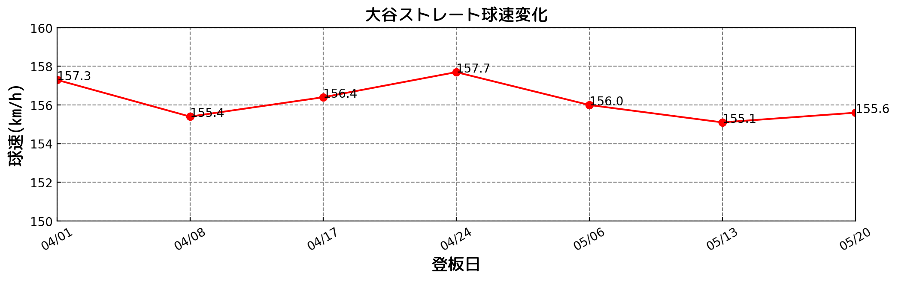
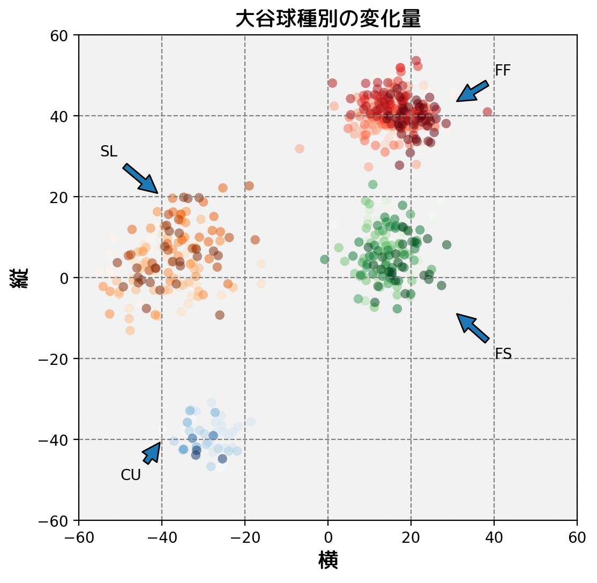
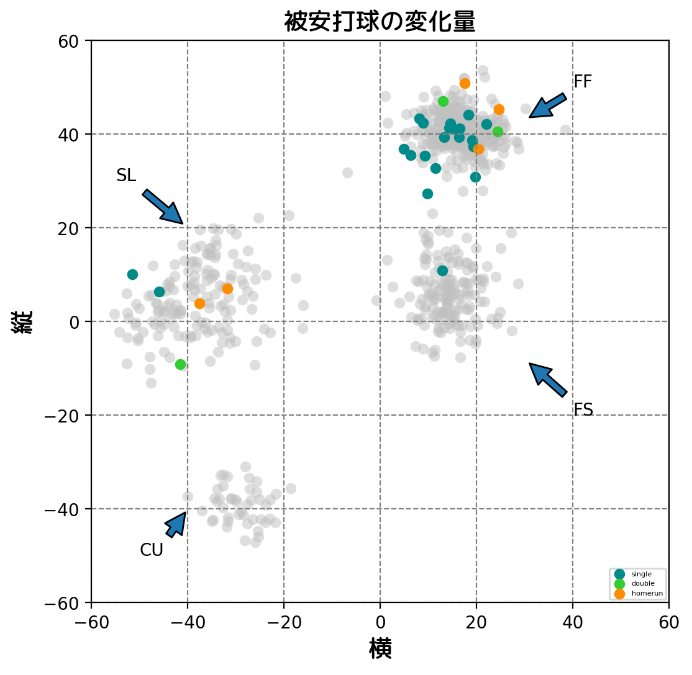
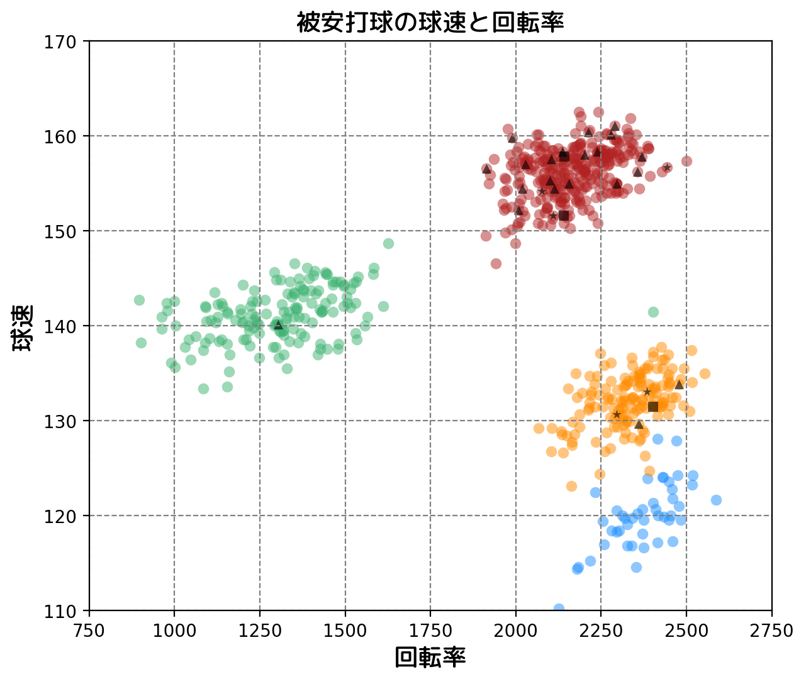
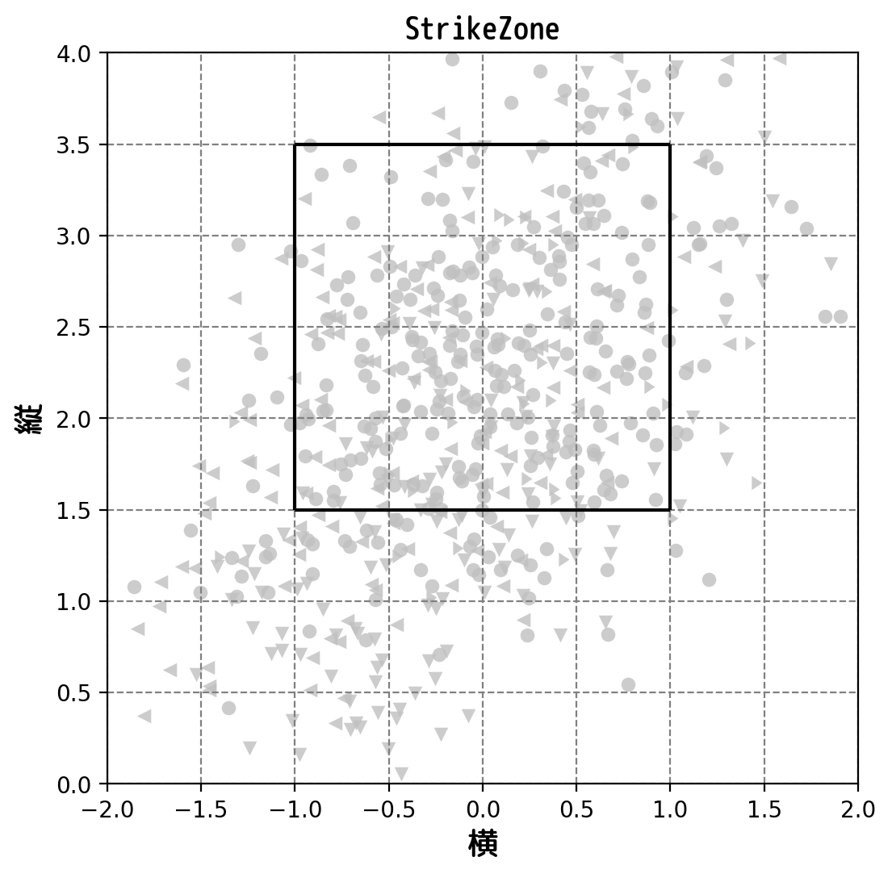
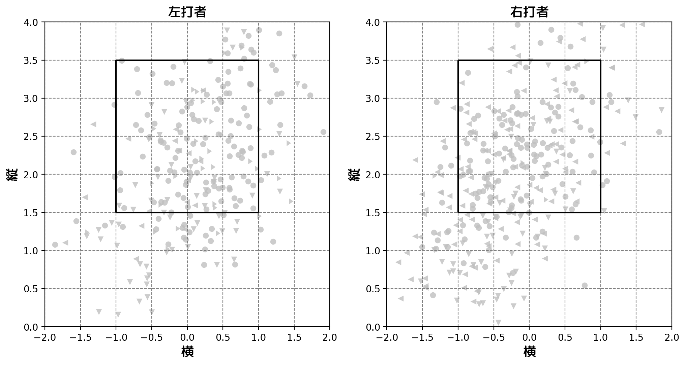
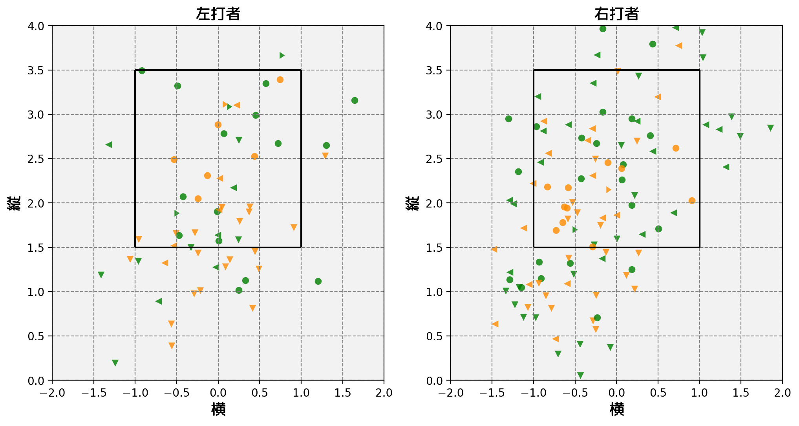
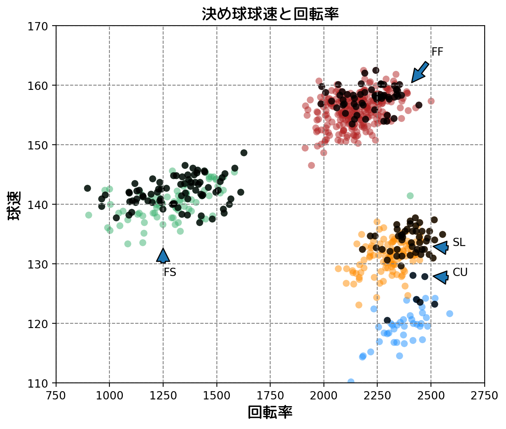

```python
import pandas as pd
import os
import matplotlib.pyplot as plt
from matplotlib import font_manager
import matplotlib as mpl

font_dir = '/usr/share/fonts/truetype/'
font_path = os.path.join(font_dir,'rounded-mgenplus-1m-medium.ttf')
font = font_manager.FontProperties(fname=font_path,size=14)

# index_col which column
df = pd.read_csv('ohtani20180521.csv',parse_dates=['game_date'])
df.head()
```


<div>
<style scoped>
    .dataframe tbody tr th:only-of-type {
        vertical-align: middle;
    }

    .dataframe tbody tr th {
        vertical-align: top;
    }

    .dataframe thead th {
        text-align: right;
    }
</style>
<table border="1" class="dataframe">
  <thead>
    <tr style="text-align: right;">
      <th></th>
      <th>pitch_type</th>
      <th>game_date</th>
      <th>release_speed</th>
      <th>release_pos_x</th>
      <th>release_pos_z</th>
      <th>player_name</th>
      <th>batter</th>
      <th>pitcher</th>
      <th>events</th>
      <th>description</th>
      <th>...</th>
      <th>home_score</th>
      <th>away_score</th>
      <th>bat_score</th>
      <th>fld_score</th>
      <th>post_away_score</th>
      <th>post_home_score</th>
      <th>post_bat_score</th>
      <th>post_fld_score</th>
      <th>if_fielding_alignment</th>
      <th>of_fielding_alignment</th>
    </tr>
  </thead>
  <tbody>
    <tr>
      <th>0</th>
      <td>FF</td>
      <td>2018-05-20</td>
      <td>97.3</td>
      <td>-2.4036</td>
      <td>5.9695</td>
      <td>Shohei Ohtani</td>
      <td>621563</td>
      <td>660271</td>
      <td>single</td>
      <td>hit_into_play_no_out</td>
      <td>...</td>
      <td>4</td>
      <td>2</td>
      <td>2</td>
      <td>4</td>
      <td>2</td>
      <td>4</td>
      <td>2</td>
      <td>4</td>
      <td>Standard</td>
      <td>Standard</td>
    </tr>
    <tr>
      <th>1</th>
      <td>CU</td>
      <td>2018-05-20</td>
      <td>73.6</td>
      <td>-2.0863</td>
      <td>6.1681</td>
      <td>Shohei Ohtani</td>
      <td>621563</td>
      <td>660271</td>
      <td>NaN</td>
      <td>ball</td>
      <td>...</td>
      <td>4</td>
      <td>2</td>
      <td>2</td>
      <td>4</td>
      <td>2</td>
      <td>4</td>
      <td>2</td>
      <td>4</td>
      <td>Standard</td>
      <td>Standard</td>
    </tr>
    <tr>
      <th>2</th>
      <td>SL</td>
      <td>2018-05-20</td>
      <td>84.4</td>
      <td>-2.5328</td>
      <td>5.7685</td>
      <td>Shohei Ohtani</td>
      <td>543068</td>
      <td>660271</td>
      <td>strikeout</td>
      <td>swinging_strike</td>
      <td>...</td>
      <td>4</td>
      <td>2</td>
      <td>2</td>
      <td>4</td>
      <td>2</td>
      <td>4</td>
      <td>2</td>
      <td>4</td>
      <td>Standard</td>
      <td>Standard</td>
    </tr>
    <tr>
      <th>3</th>
      <td>SL</td>
      <td>2018-05-20</td>
      <td>82.2</td>
      <td>-2.4996</td>
      <td>5.9198</td>
      <td>Shohei Ohtani</td>
      <td>543068</td>
      <td>660271</td>
      <td>NaN</td>
      <td>swinging_strike</td>
      <td>...</td>
      <td>4</td>
      <td>2</td>
      <td>2</td>
      <td>4</td>
      <td>2</td>
      <td>4</td>
      <td>2</td>
      <td>4</td>
      <td>Standard</td>
      <td>Standard</td>
    </tr>
    <tr>
      <th>4</th>
      <td>SL</td>
      <td>2018-05-20</td>
      <td>80.7</td>
      <td>-2.4275</td>
      <td>5.8704</td>
      <td>Shohei Ohtani</td>
      <td>543068</td>
      <td>660271</td>
      <td>NaN</td>
      <td>swinging_strike</td>
      <td>...</td>
      <td>4</td>
      <td>2</td>
      <td>2</td>
      <td>4</td>
      <td>2</td>
      <td>4</td>
      <td>2</td>
      <td>4</td>
      <td>Standard</td>
      <td>Standard</td>
    </tr>
  </tbody>
</table>
<p>5 rows × 89 columns</p>
</div>


```python
games = df.groupby('game_date')
for g,d in games:
    print(g)
    print(d.groupby('pitch_type')['release_spin_rate'].describe().round(1))
    print(d.groupby('pitch_type')['release_speed'].describe().round(1))
```

    2018-04-01 00:00:00
                count    mean   std     min     25%     50%     75%     max
    pitch_type                                                             
    CU            3.0  2479.0  93.1  2417.0  2425.5  2434.0  2510.0  2586.0
    FF           39.0  2218.8  97.2  2009.0  2138.5  2250.0  2297.0  2387.0
    FS           24.0  1445.5  98.1  1228.0  1373.8  1454.0  1517.2  1612.0
    SL           26.0  2391.5  72.3  2255.0  2349.0  2387.5  2435.8  2553.0
                count  mean  std   min   25%   50%   75%   max
    pitch_type                                                
    CU            3.0  74.9  0.6  74.5  74.6  74.6  75.1  75.6
    FF           39.0  97.8  1.3  94.2  97.2  98.1  98.6  99.6
    FS           24.0  89.3  0.9  87.5  88.5  89.4  90.0  90.8
    SL           26.0  82.3  1.5  78.8  81.6  82.0  83.5  85.4
    2018-04-08 00:00:00
                count    mean    std     min     25%     50%     75%     max
    pitch_type                                                              
    CU            2.0  2248.5  173.2  2126.0  2187.2  2248.5  2309.8  2371.0
    FF           42.0  2181.9   96.7  1968.0  2107.0  2182.5  2250.8  2337.0
    FS           33.0  1162.0  121.4   963.0  1085.0  1155.0  1240.0  1381.0
    SL           12.0  2203.1   82.1  2067.0  2138.0  2213.0  2241.2  2339.0
                count  mean  std   min   25%   50%   75%   max
    pitch_type                                                
    CU            2.0  71.0  3.5  68.5  69.7  71.0  72.2  73.4
    FF           42.0  96.5  1.7  92.4  95.7  96.3  97.8  99.6
    FS           33.0  86.5  1.8  82.9  85.4  86.7  87.6  89.4
    SL           13.0  80.9  1.1  78.7  80.3  81.1  81.6  82.5
    2018-04-17 00:00:00
                count    mean    std     min     25%     50%     75%     max
    pitch_type                                                              
    CU            1.0  2374.0    NaN  2374.0  2374.0  2374.0  2374.0  2374.0
    FF           37.0  2218.7  134.0  1962.0  2129.0  2213.0  2301.0  2500.0
    FS           13.0  1375.5  147.4  1103.0  1297.0  1427.0  1480.0  1565.0
    SL           14.0  2303.2  110.5  2104.0  2235.0  2298.0  2369.0  2516.0
                count  mean  std   min   25%   50%   75%   max
    pitch_type                                                
    CU            1.0  72.5  NaN  72.5  72.5  72.5  72.5  72.5
    FF           37.0  97.2  1.7  93.7  96.3  97.1  98.5  99.9
    FS           13.0  86.7  1.3  85.1  85.8  86.2  87.2  89.7
    SL           15.0  82.3  1.8  78.8  81.9  82.5  83.4  84.9
    2018-04-24 00:00:00
                count    mean    std     min     25%     50%     75%     max
    pitch_type                                                              
    CU            4.0  2438.5   72.7  2352.0  2395.5  2442.0  2485.0  2518.0
    FF           37.0  2189.4   92.3  1970.0  2131.0  2190.0  2247.0  2369.0
    FS           34.0  1374.2  228.4   991.0  1296.0  1354.0  1442.8  2403.0
    SL           21.0  2320.5   93.5  2154.0  2258.0  2329.0  2369.0  2492.0
                count  mean  std   min   25%   50%   75%    max
    pitch_type                                                 
    CU            4.0  75.2  2.8  71.2  74.0  76.1  77.2   77.2
    FF           37.0  98.0  1.7  94.7  97.0  98.0  98.7  101.0
    FS           34.0  88.4  1.7  84.6  87.4  88.0  89.7   92.4
    SL           23.0  83.4  1.2  80.7  82.8  83.2  84.1   85.6
    2018-05-06 00:00:00
                count    mean    std     min     25%     50%     75%     max
    pitch_type                                                              
    CU           11.0  2401.7   90.4  2232.0  2372.5  2448.0  2456.0  2516.0
    FF           48.0  2124.6   99.0  1912.0  2071.8  2118.0  2180.0  2362.0
    FS           11.0  1206.4  115.5   980.0  1148.0  1219.0  1289.5  1365.0
    SL           28.0  2335.1   89.1  2149.0  2292.8  2342.0  2405.5  2483.0
                count  mean  std   min   25%   50%   75%   max
    pitch_type                                                
    CU           11.0  75.4  1.1  74.2  74.4  75.2  76.4  77.0
    FF           48.0  96.9  1.4  92.9  96.0  97.0  98.0  99.5
    FS           11.0  87.5  0.9  85.8  87.0  87.6  88.0  88.9
    SL           28.0  82.1  1.6  77.3  81.2  82.3  83.2  85.0
    2018-05-13 00:00:00
                count    mean    std     min     25%     50%     75%     max
    pitch_type                                                              
    CU           16.0  2362.1   94.2  2182.0  2295.8  2379.0  2437.5  2484.0
    FF           43.0  2119.0   97.0  1925.0  2040.5  2126.0  2189.5  2304.0
    FS           19.0  1212.3  156.1   897.0  1110.5  1217.0  1311.0  1496.0
    SL           24.0  2362.3   76.4  2164.0  2312.0  2366.0  2416.0  2510.0
                count  mean  std   min   25%   50%   75%   max
    pitch_type                                                
    CU           16.0  74.6  2.5  71.2  72.8  74.2  75.6  79.6
    FF           43.0  96.4  1.6  93.1  94.9  96.5  97.6  99.4
    FS           20.0  87.2  1.2  85.1  86.1  87.2  88.2  89.6
    SL           24.0  81.2  1.7  77.5  80.2  81.2  82.1  84.2
    2018-05-20 00:00:00
                count    mean    std     min     25%     50%     75%     max
    pitch_type                                                              
    CU            8.0  2313.1   69.5  2180.0  2297.5  2315.5  2339.8  2429.0
    FF           55.0  2114.6  107.6  1914.0  2022.0  2109.0  2193.0  2343.0
    FS           21.0  1359.2  109.7  1041.0  1303.0  1353.0  1422.0  1558.0
    SL           25.0  2323.5   92.7  2133.0  2277.0  2319.0  2390.0  2477.0
                count  mean  std   min   25%   50%   75%   max
    pitch_type                                                
    CU            8.0  73.9  1.7  71.1  73.4  74.0  74.4  77.1
    FF           55.0  96.7  1.7  91.1  95.6  97.3  97.9  99.0
    FS           22.0  87.8  1.8  84.5  86.5  87.7  89.3  90.6
    SL           25.0  82.1  2.0  76.5  81.2  82.3  83.2  85.2


```python
2
for g,d in games:
    print(g)
    # .mean() returns series
    print('horizon movement')
    print(d.groupby('pitch_type')['pfx_x'].mean().apply(ft_cm).round(3))
    print('vertical movement')
    print(d.groupby('pitch_type')['pfx_z'].mean().apply(ft_cm).round(3))
    print('-----------------------------------------------------')
```

    2018-04-01 00:00:00
    horizon movement
    pitch_type
    CU    29.637
    FF   -20.501
    FS   -17.867
    SL    38.123
    Name: pfx_x, dtype: float64
    vertical movement
    pitch_type
    CU   -43.734
    FF    39.000
    FS     3.309
    SL     4.625
    Name: pfx_z, dtype: float64
    -----------------------------------------------------
    2018-04-08 00:00:00
    horizon movement
    pitch_type
    CU    30.146
    FF   -15.376
    FS   -14.267
    SL    35.017
    Name: pfx_x, dtype: float64
    vertical movement
    pitch_type
    CU   -39.339
    FF    42.896
    FS     6.387
    SL     8.308
    Name: pfx_z, dtype: float64
    -----------------------------------------------------
    2018-04-17 00:00:00
    horizon movement
    pitch_type
    CU    34.765
    FF   -16.918
    FS   -14.946
    SL    32.024
    Name: pfx_x, dtype: float64
    vertical movement
    pitch_type
    CU   -42.389
    FF    43.218
    FS     6.191
    SL    12.186
    Name: pfx_z, dtype: float64
    -----------------------------------------------------
    2018-04-24 00:00:00
    horizon movement
    pitch_type
    CU    31.496
    FF   -15.069
    FS   -12.739
    SL    38.323
    Name: pfx_x, dtype: float64
    vertical movement
    pitch_type
    CU   -35.918
    FF    38.149
    FS     5.876
    SL     5.741
    Name: pfx_z, dtype: float64
    -----------------------------------------------------
    2018-05-06 00:00:00
    horizon movement
    pitch_type
    CU    29.543
    FF   -12.495
    FS   -13.515
    SL    39.898
    Name: pfx_x, dtype: float64
    vertical movement
    pitch_type
    CU   -41.203
    FF    39.710
    FS     2.733
    SL    -0.236
    Name: pfx_z, dtype: float64
    -----------------------------------------------------
    2018-05-13 00:00:00
    horizon movement
    pitch_type
    CU    25.860
    FF   -17.190
    FS   -13.013
    SL    36.518
    Name: pfx_x, dtype: float64
    vertical movement
    pitch_type
    CU   -37.308
    FF    39.480
    FS     6.973
    SL     2.018
    Name: pfx_z, dtype: float64
    -----------------------------------------------------
    2018-05-20 00:00:00
    horizon movement
    pitch_type
    CU    31.693
    FF   -18.344
    FS   -14.531
    SL    42.727
    Name: pfx_x, dtype: float64
    vertical movement
    pitch_type
    CU   -39.654
    FF    41.449
    FS     9.363
    SL     5.891
    Name: pfx_z, dtype: float64
    -----------------------------------------------------


```python
import numpy as np
def mph_kmh(x):
    return x*1.60934
dates = []
FF_speed = []
CU_speed = []
FS_speed = []
SL_speed = []
for date,d in games:
    tmp = d.groupby('pitch_type')['release_speed'].mean().apply(mph_kmh).round(1)
    dates.append(date.strftime('%m/%d'))
    FF_speed.append(tmp['FF'])
    CU_speed.append(tmp['CU'])
    FS_speed.append(tmp['FS'])
    SL_speed.append(tmp['SL'])
dates = np.array(dates)
FF_speed = np.array(FF_speed)
CU_speed = np.array(CU_speed)
FS_speed = np.array(FS_speed)
SL_speed = np.array(SL_speed)
dates
```


    array(['04/01', '04/08', '04/17', '04/24', '05/06', '05/13', '05/20'],
          dtype='<U5')


```python
%matplotlib inline
from matplotlib.dates import DateFormatter
# the canvas
fig = plt.figure(figsize=(12,3),dpi=200)
# fig = plt.figure()
plt.rcParams['axes.xmargin'] = 0
ax = fig.add_subplot(111)
index = [i for i in range(7)]
ax.set_title('大谷ストレート球速変化',fontproperties=font)
ax.set_xlabel('登板日',fontproperties=font)
ax.set_ylabel('球速(km/h)',fontproperties=font)
ax.grid(color='gray',linestyle='--')
ax.set_ylim((150.0,160.0))

ax.plot(index,FF_speed,'-or')
plt.xticks(index,dates, fontsize=10, rotation=30)
# ax.xaxis.set_major_formatter(DateFormatter('%m/%d'))
for a,b in zip(index,FF_speed):
    plt.text(a,b,str(b))

plt.gca().yaxis.set_tick_params(which='both', direction='in',bottom=True, left=True)
plt.gca().xaxis.set_tick_params(which='both', direction='in',bottom=True,  left=True)

ax.legend()

plt.savefig('ohtani_straight_speed.png') # -----(2)
```

    /home/zhou/.pyenv/versions/3.6.3/envs/scraping/lib/python3.6/site-packages/matplotlib/font_manager.py:1316: UserWarning: findfont: Font family ['rounded-mgenplus-1m-medium'] not found. Falling back to DejaVu Sans
      (prop.get_family(), self.defaultFamily[fontext]))





```python
dt = list(set(df['game_date']))
dt.sort()
index = [i for i in range(len(dt),0,-1)]
mark = list()
for _,i in df.iterrows():
     for j,m in zip(dt,index):
            if i['game_date'] == j:
                mark.append(m)
df['marker'] = mark
```


```python
pitch_type = games = df.groupby('pitch_type')
FF = pitch_type.get_group('FF')
SL = pitch_type.get_group('SL')
CU = pitch_type.get_group('CU')
FS = pitch_type.get_group('FS')
```


```python
def inverse(x):
    return x*(-1)
# the canvas
fig1 = plt.figure(figsize=(6,6),dpi=200)
# fig = plt.figure()
plt.rcParams['axes.xmargin'] = 0
ax_sc = fig1.add_subplot(111)
ax_sc.set_title('大谷球種別の変化量',fontproperties=font)
ax_sc.set_xlabel('横',fontproperties=font)
ax_sc.set_ylabel('縦',fontproperties=font)
ax_sc.grid(color='gray',linestyle='--')
ax_sc.set_xlim((-60,60))
ax_sc.set_ylim((-60,60))
plt.xticks(np.arange(-60,61,step=20))
ax_sc.annotate('FF', xy=(30, 43), xytext=(40, 50),arrowprops=dict(shrink=0.1))
ax_sc.annotate('FS', xy=(30, -8), xytext=(40, -20),arrowprops=dict(shrink=0.1))
ax_sc.annotate('SL', xy=(-40, 20), xytext=(-55, 30),arrowprops=dict(shrink=0.1))
ax_sc.annotate('CU', xy=(-40, -40), xytext=(-50, -50),arrowprops=dict(shrink=0.1))
p1=ax_sc.scatter(FF['pfx_x'].apply(ft_cm).apply(inverse),FF['pfx_z'].apply(ft_cm),s=40,c=FF['marker'],cmap='Reds',alpha=0.5,linewidth=0,label='FF')
p2=ax_sc.scatter(CU['pfx_x'].apply(ft_cm).apply(inverse),CU['pfx_z'].apply(ft_cm),s=40,c=CU['marker'],cmap='Blues',alpha=0.5,linewidth=0,label='CU')
p3=ax_sc.scatter(SL['pfx_x'].apply(ft_cm).apply(inverse),SL['pfx_z'].apply(ft_cm),s=40,c=SL['marker'],cmap='Oranges',alpha=0.5,linewidth=0,label='SL')
p4=ax_sc.scatter(FS['pfx_x'].apply(ft_cm).apply(inverse),FS['pfx_z'].apply(ft_cm),s=40,c=FS['marker'],cmap='Greens',alpha=0.5,linewidth=0,label='FS')
ax_sc.patch.set_facecolor('gray')
ax_sc.patch.set_alpha(0.1) 
# plt.xticks(index,dates, fontsize=10, rotation=30)
# ax.xaxis.set_major_formatter(DateFormatter('%m/%d'))

# fig1.colorbar(p1)
# fig1.colorbar(p2)
# fig1.colorbar(p3)
# fig1.colorbar(p4)
# ax_sc.legend(loc=4,
#             fontsize=4)
fig1.show()
plt.savefig('ohtani_movement.png') # -----(2)
```

    /home/zhou/.pyenv/versions/3.6.3/envs/scraping/lib/python3.6/site-packages/matplotlib/figure.py:418: UserWarning: matplotlib is currently using a non-GUI backend, so cannot show the figure
      "matplotlib is currently using a non-GUI backend, "
    /home/zhou/.pyenv/versions/3.6.3/envs/scraping/lib/python3.6/site-packages/matplotlib/font_manager.py:1316: UserWarning: findfont: Font family ['rounded-mgenplus-1m-medium'] not found. Falling back to DejaVu Sans
      (prop.get_family(), self.defaultFamily[fontext]))





```python
pitch_type = games = df.groupby('events')
single = pitch_type.get_group('single')
home_run = pitch_type.get_group('home_run')
double = pitch_type.get_group('double')
# triple = pitch_type.get_group('triple')

# the canvas
fig2 = plt.figure(figsize=(6,6),dpi=200)
# fig = plt.figure()
plt.rcParams['axes.xmargin'] = 0
ax_hit = fig2.add_subplot(111)
ax_hit.set_title('被安打球の変化量',fontproperties=font)
ax_hit.set_xlabel('横',fontproperties=font)
ax_hit.set_ylabel('縦',fontproperties=font)
ax_hit.grid(color='gray',linestyle='--')
ax_hit.set_xlim((-60,60))
ax_hit.set_ylim((-60,60))
plt.xticks(np.arange(-60,61,step=20))
ax_hit.annotate('FF', xy=(30, 43), xytext=(40, 50),arrowprops=dict(shrink=0.1))
ax_hit.annotate('FS', xy=(30, -8), xytext=(40, -20),arrowprops=dict(shrink=0.1))
ax_hit.annotate('SL', xy=(-40, 20), xytext=(-55, 30),arrowprops=dict(shrink=0.1))
ax_hit.annotate('CU', xy=(-40, -40), xytext=(-50, -50),arrowprops=dict(shrink=0.1))
p1=ax_hit.scatter(FF['pfx_x'].apply(ft_cm).apply(inverse),FF['pfx_z'].apply(ft_cm),s=40,c='silver',alpha=0.5,linewidth=0,label='FF')
p2=ax_hit.scatter(CU['pfx_x'].apply(ft_cm).apply(inverse),CU['pfx_z'].apply(ft_cm),s=40,c='silver',alpha=0.5,linewidth=0,label='CU')
p3=ax_hit.scatter(SL['pfx_x'].apply(ft_cm).apply(inverse),SL['pfx_z'].apply(ft_cm),s=40,c='silver',alpha=0.5,linewidth=0,label='SL')
p4=ax_hit.scatter(FS['pfx_x'].apply(ft_cm).apply(inverse),FS['pfx_z'].apply(ft_cm),s=40,c='silver',alpha=0.5,linewidth=0,label='FS')
p5=ax_hit.scatter(single['pfx_x'].apply(ft_cm).apply(inverse),single['pfx_z'].apply(ft_cm),s=40,c='darkcyan',linewidth=0,label='single')
p6=ax_hit.scatter(double['pfx_x'].apply(ft_cm).apply(inverse),double['pfx_z'].apply(ft_cm),s=40,c='limegreen',linewidth=0,label='double')
p7=ax_hit.scatter(home_run['pfx_x'].apply(ft_cm).apply(inverse),home_run['pfx_z'].apply(ft_cm),s=40,c='darkorange',linewidth=0,label='home_run')


# ax_sc.patch.set_facecolor('gray')
ax_hit.patch.set_alpha(0.1) 
# plt.xticks(index,dates, fontsize=10, rotation=30)
# ax.xaxis.set_major_formatter(DateFormatter('%m/%d'))

# fig1.colorbar(p1)
# fig1.colorbar(p2)
# fig1.colorbar(p3)
# fig1.colorbar(p4)
ax_hit.legend([p5,p6,p7],
             ['single','double','homerun'],
             loc=4,
            fontsize=4)
fig2.show()
plt.savefig('ohtani_hitted.png') # -----(2)
```

    /home/zhou/.pyenv/versions/3.6.3/envs/scraping/lib/python3.6/site-packages/matplotlib/figure.py:418: UserWarning: matplotlib is currently using a non-GUI backend, so cannot show the figure
      "matplotlib is currently using a non-GUI backend, "
    /home/zhou/.pyenv/versions/3.6.3/envs/scraping/lib/python3.6/site-packages/matplotlib/font_manager.py:1316: UserWarning: findfont: Font family ['rounded-mgenplus-1m-medium'] not found. Falling back to DejaVu Sans
      (prop.get_family(), self.defaultFamily[fontext]))





```python
# the canvas
fig3 = plt.figure(figsize=(7,6),dpi=200)
# fig = plt.figure()
plt.rcParams['axes.xmargin'] = 0
ax_hitted = fig3.add_subplot(111)
ax_hitted.set_title('被安打球の球速と回転率',fontproperties=font)
ax_hitted.set_xlabel('回転率',fontproperties=font)
ax_hitted.set_ylabel('球速',fontproperties=font)
ax_hitted.grid(color='gray',linestyle='--')
ax_hitted.set_xlim((750,2750))
ax_hitted.set_ylim((110,170))
plt.yticks(np.arange(110,171,step=10))
plt.xticks(np.arange(750,2751,step=250))
# ax_hit.annotate('FF', xy=(30, 43), xytext=(40, 50),arrowprops=dict(shrink=0.1))
# ax_hit.annotate('FS', xy=(30, -8), xytext=(40, -20),arrowprops=dict(shrink=0.1))
# ax_hit.annotate('SL', xy=(-40, 20), xytext=(-55, 30),arrowprops=dict(shrink=0.1))
# ax_hit.annotate('CU', xy=(-40, -40), xytext=(-50, -50),arrowprops=dict(shrink=0.1))
p1=ax_hitted.scatter(FF['release_spin_rate'],FF['release_speed'].apply(mph_kmh),s=40,c='firebrick',alpha=0.5,linewidth=0,label='FF')
p2=ax_hitted.scatter(CU['release_spin_rate'],CU['release_speed'].apply(mph_kmh),s=40,c='dodgerblue',alpha=0.5,linewidth=0,label='CU')
p3=ax_hitted.scatter(SL['release_spin_rate'],SL['release_speed'].apply(mph_kmh),s=40,c='darkorange',alpha=0.5,linewidth=0,label='SL')
p4=ax_hitted.scatter(FS['release_spin_rate'],FS['release_speed'].apply(mph_kmh),s=40,c='mediumseagreen',alpha=0.5,linewidth=0,label='FS')

p5=ax_hitted.scatter(single['release_spin_rate'],single['release_speed'].apply(mph_kmh),s=30,c='black',marker='^',alpha=0.6,linewidth=0,label='single')
p6=ax_hitted.scatter(double['release_spin_rate'],double['release_speed'].apply(mph_kmh),s=30,c='black',marker='s',alpha=0.6,linewidth=0,label='double')
p7=ax_hitted.scatter(home_run['release_spin_rate'],home_run['release_speed'].apply(mph_kmh),s=30,c='black',marker='*',alpha=0.6,linewidth=0,label='homerun')


# ax_sc.patch.set_facecolor('gray')
ax_hit.patch.set_alpha(0.1) 
# plt.xticks(index,dates, fontsize=10, rotation=30)
# ax.xaxis.set_major_formatter(DateFormatter('%m/%d'))

# fig1.colorbar(p1)
# fig1.colorbar(p2)
# fig1.colorbar(p3)
# fig1.colorbar(p4)
# ax_hit.legend([p5,p6,p7],
#              ['single','double','homerun'],
#              loc=4,
#             fontsize=4)
fig3.show()
plt.savefig('ohtani_hitted_speed_rpm.png') # -----(2)
```

    /home/zhou/.pyenv/versions/3.6.3/envs/scraping/lib/python3.6/site-packages/matplotlib/figure.py:418: UserWarning: matplotlib is currently using a non-GUI backend, so cannot show the figure
      "matplotlib is currently using a non-GUI backend, "
    /home/zhou/.pyenv/versions/3.6.3/envs/scraping/lib/python3.6/site-packages/matplotlib/font_manager.py:1316: UserWarning: findfont: Font family ['rounded-mgenplus-1m-medium'] not found. Falling back to DejaVu Sans
      (prop.get_family(), self.defaultFamily[fontext]))





```python
# the canvas
fig4 = plt.figure(figsize=(6,6),dpi=200)
# fig = plt.figure()
plt.rcParams['axes.xmargin'] = 0
ax_sz = fig4.add_subplot(111)
ax_sz.set_title('StrikeZone',fontproperties=font)
ax_sz.set_xlabel('横',fontproperties=font)
ax_sz.set_ylabel('縦',fontproperties=font)
ax_sz.grid(color='gray',linestyle='--')
ax_sz.set_xlim((-2,2))
ax_sz.set_ylim((0,4))
plt.yticks(np.arange(0,4.1,step=0.5))
plt.xticks(np.arange(-2,2.1,step=0.5))
# ax_hit.annotate('FF', xy=(30, 43), xytext=(40, 50),arrowprops=dict(shrink=0.1))
# ax_hit.annotate('FS', xy=(30, -8), xytext=(40, -20),arrowprops=dict(shrink=0.1))
# ax_hit.annotate('SL', xy=(-40, 20), xytext=(-55, 30),arrowprops=dict(shrink=0.1))
# ax_hit.annotate('CU', xy=(-40, -40), xytext=(-50, -50),arrowprops=dict(shrink=0.1))
p1=ax_sz.scatter(FF['plate_x'].apply(inverse),FF['plate_z'],s=40,c='silver',alpha=0.8,linewidth=0,label='FF')
p2=ax_sz.scatter(CU['plate_x'].apply(inverse),CU['plate_z'],s=40,c='silver',alpha=0.8,marker=5,linewidth=0,label='CU')
p3=ax_sz.scatter(SL['plate_x'].apply(inverse),SL['plate_z'],s=40,c='silver',alpha=0.8,marker='<',linewidth=0,label='SL')
p4=ax_sz.scatter(FS['plate_x'].apply(inverse),FS['plate_z'],s=40,c='silver',alpha=0.8,marker='v',linewidth=0,label='FS')

# p5=ax_sz.scatter(single['plate_x'].apply(inverse),single['plate_z'],s=40,c='red',marker='^',alpha=0.6,linewidth=0,label='single')
# p6=ax_sz.scatter(double['plate_x'].apply(inverse),double['plate_z'],s=40,c='red',marker='s',alpha=0.6,linewidth=0,label='double')
# p7=ax_sz.scatter(home_run['plate_x'].apply(inverse),home_run['plate_z'],s=40,c='red',marker='*',alpha=0.6,linewidth=0,label='homerun')


# ax_sc.patch.set_facecolor('gray')
ax_sz.patch.set_alpha(0.1) 
# Strike Zone
ax_sz.vlines(-1, ymin=1.5, ymax=3.5)
ax_sz.vlines(1, ymin=1.5, ymax=3.5)
ax_sz.hlines(1.5, xmin=-1, xmax=1)
ax_sz.hlines(3.5, xmin=-1, xmax=1)
# plt.xticks(index,dates, fontsize=10, rotation=30)
# ax.xaxis.set_major_formatter(DateFormatter('%m/%d'))

# fig1.colorbar(p1)
# fig1.colorbar(p2)
# fig1.colorbar(p3)
# fig1.colorbar(p4)
# ax_hit.legend([p5,p6,p7],
#              ['single','double','homerun'],
#              loc=4,
#             fontsize=4)
fig4.show()
plt.savefig('ohtani_sz.png') # -----(2)
```

    /home/zhou/.pyenv/versions/3.6.3/envs/scraping/lib/python3.6/site-packages/matplotlib/figure.py:418: UserWarning: matplotlib is currently using a non-GUI backend, so cannot show the figure
      "matplotlib is currently using a non-GUI backend, "
    /home/zhou/.pyenv/versions/3.6.3/envs/scraping/lib/python3.6/site-packages/matplotlib/font_manager.py:1316: UserWarning: findfont: Font family ['rounded-mgenplus-1m-medium'] not found. Falling back to DejaVu Sans
      (prop.get_family(), self.defaultFamily[fontext]))





```python
# the canvas
fig5 = plt.figure(figsize=(12,6),dpi=200)
# fig = plt.figure()
plt.rcParams['axes.xmargin'] = 0
ax_l = fig5.add_subplot(121)
ax_r = fig5.add_subplot(122)
ax_l.set_title('左打者',fontproperties=font)
ax_r.set_title('右打者',fontproperties=font)
ax_l.set_xlabel('横',fontproperties=font)
ax_l.set_ylabel('縦',fontproperties=font)
ax_r.set_xlabel('横',fontproperties=font)
ax_r.set_ylabel('縦',fontproperties=font)
ax_l.grid(color='gray',linestyle='--')
ax_r.grid(color='gray',linestyle='--')
ax_l.set_xlim((-2,2))
ax_l.set_ylim((0,4))
ax_r.set_xlim((-2,2))
ax_r.set_ylim((0,4))
plt.yticks(np.arange(0,4.1,step=0.5))
plt.xticks(np.arange(-2,2.1,step=0.5))
def plot_by_pt(ax,r):
    if r['pitch_type'] == 'FF':
        ax.scatter(r['plate_x']*(-1),r['plate_z'],s=40,c='silver',marker='o',alpha=0.8,linewidth=0,label='FF')
    elif r['pitch_type'] == 'CU':
        ax.scatter(r['plate_x']*(-1),r['plate_z'],s=40,c='silver',marker=5,alpha=0.8,linewidth=0,label='FF')
    elif r['pitch_type'] == 'FS':
        ax.scatter(r['plate_x']*(-1),r['plate_z'],s=40,c='silver',marker='v',alpha=0.8,linewidth=0,label='FF')
    else:
        ax.scatter(r['plate_x']*(-1),r['plate_z'],s=40,c='silver',marker='<',alpha=0.8,linewidth=0,label='FF')

for _,r in df.iterrows():
    # judge left or right
    if r['stand'] == 'R':
        plot_by_pt(ax_r,r)
    else:
        plot_by_pt(ax_l,r)
    

# p1=ax_sz.scatter(FF['plate_x'].apply(inverse),FF['plate_z'],s=40,c='silver',alpha=0.8,linewidth=0,label='FF')
# p2=ax_sz.scatter(CU['plate_x'].apply(inverse),CU['plate_z'],s=40,c='silver',alpha=0.8,marker=5,linewidth=0,label='CU')
# p3=ax_sz.scatter(SL['plate_x'].apply(inverse),SL['plate_z'],s=40,c='silver',alpha=0.8,marker='<',linewidth=0,label='SL')
# p4=ax_sz.scatter(FS['plate_x'].apply(inverse),FS['plate_z'],s=40,c='silver',alpha=0.8,marker='v',linewidth=0,label='FS')

# p5=ax_sz.scatter(single['plate_x'].apply(inverse),single['plate_z'],s=40,c='red',marker='^',alpha=0.6,linewidth=0,label='single')
# p6=ax_sz.scatter(double['plate_x'].apply(inverse),double['plate_z'],s=40,c='red',marker='s',alpha=0.6,linewidth=0,label='double')
# p7=ax_sz.scatter(home_run['plate_x'].apply(inverse),home_run['plate_z'],s=40,c='red',marker='*',alpha=0.6,linewidth=0,label='homerun')


# ax_sc.patch.set_facecolor('gray')
ax_l.patch.set_alpha(0.1) 
ax_r.patch.set_alpha(0.1) 
# Strike Zone
ax_l.vlines(-1, ymin=1.5, ymax=3.5)
ax_l.vlines(1, ymin=1.5, ymax=3.5)
ax_l.hlines(1.5, xmin=-1, xmax=1)
ax_l.hlines(3.5, xmin=-1, xmax=1)

ax_r.vlines(-1, ymin=1.5, ymax=3.5)
ax_r.vlines(1, ymin=1.5, ymax=3.5)
ax_r.hlines(1.5, xmin=-1, xmax=1)
ax_r.hlines(3.5, xmin=-1, xmax=1)
# plt.xticks(index,dates, fontsize=10, rotation=30)
# ax.xaxis.set_major_formatter(DateFormatter('%m/%d'))

# fig1.colorbar(p1)
# fig1.colorbar(p2)
# fig1.colorbar(p3)
# fig1.colorbar(p4)
# ax_hit.legend([p5,p6,p7],
#              ['single','double','homerun'],
#              loc=4,
#             fontsize=4)
fig5.show()
plt.savefig('ohtani_lr.png') # -----(2)
```

    /home/zhou/.pyenv/versions/3.6.3/envs/scraping/lib/python3.6/site-packages/matplotlib/figure.py:418: UserWarning: matplotlib is currently using a non-GUI backend, so cannot show the figure
      "matplotlib is currently using a non-GUI backend, "
    /home/zhou/.pyenv/versions/3.6.3/envs/scraping/lib/python3.6/site-packages/matplotlib/font_manager.py:1316: UserWarning: findfont: Font family ['rounded-mgenplus-1m-medium'] not found. Falling back to DejaVu Sans
      (prop.get_family(), self.defaultFamily[fontext]))





```python
import math
str(df['des'][1])
set(df['description'])
```


    {'ball',
     'blocked_ball',
     'called_strike',
     'foul',
     'foul_tip',
     'hit_by_pitch',
     'hit_into_play',
     'hit_into_play_no_out',
     'hit_into_play_score',
     'missed_bunt',
     'swinging_strike',
     'swinging_strike_blocked'}


```python
# the canvas
fig6 = plt.figure(figsize=(12,6),dpi=200)
# fig = plt.figure()
plt.rcParams['axes.xmargin'] = 0

# left/right axis
ax_l = fig6.add_subplot(121)
ax_r = fig6.add_subplot(122)
ax_l.set_title('左打者',fontproperties=font)
ax_r.set_title('右打者',fontproperties=font)
ax_l.set_xlabel('横',fontproperties=font)
ax_l.set_ylabel('縦',fontproperties=font)
ax_r.set_xlabel('横',fontproperties=font)
ax_r.set_ylabel('縦',fontproperties=font)
ax_l.grid(color='gray',linestyle='--')
ax_r.grid(color='gray',linestyle='--')
ax_l.set_xlim((-2,2))
ax_l.set_ylim((0,4))
ax_r.set_xlim((-2,2))
ax_r.set_ylim((0,4))
plt.yticks(np.arange(0,4.1,step=0.5))
plt.xticks(np.arange(-2,2.1,step=0.5))

# winning ball
def plot_by_wb(ax,r):
    if r['strikes'] == 2 and str(r['des']) != 'nan':
        plot_by_pt_c(ax,r,1) 
    elif r['strikes'] == 2 and str(r['des']) =='nan':   
        plot_by_pt_c(ax,r,0)

# winning ball result        
def plot_by_des(ax,r):
    color_d = {'ball':'green',
        'blocked_ball':'green',
        'called_strike':'darkorange',
        'foul':'green',
        'foul_tip':'green',
        'hit_by_pitch':'green',
        'hit_into_play':'darkorange',
        'hit_into_play_no_out':'green',
        'hit_into_play_score':'green',
        'missed_bunt':'darkorange',
        'swinging_strike':'darkorange',
        'swinging_strike_blocked':'darkorange'}
    if r['strikes'] == 2 :
        if r['pitch_type'] == 'FF':
            ax.scatter(r['plate_x']*(-1),r['plate_z'],s=40,c=color_d[r['description']],marker='o',alpha=0.8,linewidth=0,label='FF')
        elif r['pitch_type'] == 'CU':
            ax.scatter(r['plate_x']*(-1),r['plate_z'],s=40,c=color_d[r['description']],marker=5,alpha=0.8,linewidth=0,label='FF')
        elif r['pitch_type'] == 'FS':
            ax.scatter(r['plate_x']*(-1),r['plate_z'],s=40,c=color_d[r['description']],marker='v',alpha=0.8,linewidth=0,label='FF')
        else:
            ax.scatter(r['plate_x']*(-1),r['plate_z'],s=40,c=color_d[r['description']],marker='<',alpha=0.8,linewidth=0,label='FF')

        
def plot_by_pt_c(ax,r,c=0):
    if c == 0:
        color_d = {'FF':'gray','CU':'gray','FS':'gray','SL':'gray'}
    elif c == 1:
        color_d = {'FF':'firebrick','CU':'dodgerblue','FS':'darkorange','SL':'mediumseagreen'}
    if r['pitch_type'] == 'FF':
        ax.scatter(r['plate_x']*(-1),r['plate_z'],s=40,c=color_d['FF'],marker='o',alpha=0.8,linewidth=0,label='FF')
    elif r['pitch_type'] == 'CU':
        ax.scatter(r['plate_x']*(-1),r['plate_z'],s=40,c=color_d['CU'],marker=5,alpha=0.8,linewidth=0,label='FF')
    elif r['pitch_type'] == 'FS':
        ax.scatter(r['plate_x']*(-1),r['plate_z'],s=40,c=color_d['FS'],marker='v',alpha=0.8,linewidth=0,label='FF')
    else:
        ax.scatter(r['plate_x']*(-1),r['plate_z'],s=40,c=color_d['SL'],marker='<',alpha=0.8,linewidth=0,label='FF')

for _,r in df.iterrows():
    # judge left or right
    if r['stand'] == 'R':
#         plot_by_wb(ax_r,r)
        plot_by_des(ax_r,r)
    else:
#         plot_by_wb(ax_l,r)
        plot_by_des(ax_l,r)
    


# ax_sc.patch.set_facecolor('gray')
ax_l.patch.set_alpha(0.1) 
ax_r.patch.set_alpha(0.1) 
# Strike Zone
ax_l.vlines(-1, ymin=1.5, ymax=3.5)
ax_l.vlines(1, ymin=1.5, ymax=3.5)
ax_l.hlines(1.5, xmin=-1, xmax=1)
ax_l.hlines(3.5, xmin=-1, xmax=1)

ax_r.vlines(-1, ymin=1.5, ymax=3.5)
ax_r.vlines(1, ymin=1.5, ymax=3.5)
ax_r.hlines(1.5, xmin=-1, xmax=1)
ax_r.hlines(3.5, xmin=-1, xmax=1)
# plt.xticks(index,dates, fontsize=10, rotation=30)
# ax.xaxis.set_major_formatter(DateFormatter('%m/%d'))

# fig1.colorbar(p1)
# fig1.colorbar(p2)
# fig1.colorbar(p3)
# fig1.colorbar(p4)
# ax_hit.legend([p5,p6,p7],
#              ['single','double','homerun'],
#              loc=4,
#             fontsize=4)
ax_l.patch.set_facecolor('gray')
ax_r.patch.set_facecolor('gray')

fig6.show()
plt.savefig('ohtani_wb_by_result1.png') # -----(2)
```

    /home/zhou/.pyenv/versions/3.6.3/envs/scraping/lib/python3.6/site-packages/matplotlib/figure.py:418: UserWarning: matplotlib is currently using a non-GUI backend, so cannot show the figure
      "matplotlib is currently using a non-GUI backend, "
    /home/zhou/.pyenv/versions/3.6.3/envs/scraping/lib/python3.6/site-packages/matplotlib/font_manager.py:1316: UserWarning: findfont: Font family ['rounded-mgenplus-1m-medium'] not found. Falling back to DejaVu Sans
      (prop.get_family(), self.defaultFamily[fontext]))





```python
# the canvas
fig7 = plt.figure(figsize=(7,6),dpi=200)
# fig = plt.figure()
plt.rcParams['axes.xmargin'] = 0
ax = fig7.add_subplot(111)
ax.set_title('決め球球速と回転率',fontproperties=font)
ax.set_xlabel('回転率',fontproperties=font)
ax.set_ylabel('球速',fontproperties=font)
ax.grid(color='gray',linestyle='--')
ax.set_xlim((750,2750))
ax.set_ylim((110,170))
plt.yticks(np.arange(110,171,step=10))
plt.xticks(np.arange(750,2751,step=250))

p1=ax.scatter(FF['release_spin_rate'],FF['release_speed'].apply(mph_kmh),s=40,c='firebrick',alpha=0.5,linewidth=0,label='FF')
p2=ax.scatter(CU['release_spin_rate'],CU['release_speed'].apply(mph_kmh),s=40,c='dodgerblue',alpha=0.5,linewidth=0,label='CU')
p3=ax.scatter(SL['release_spin_rate'],SL['release_speed'].apply(mph_kmh),s=40,c='darkorange',alpha=0.5,linewidth=0,label='SL')
p4=ax.scatter(FS['release_spin_rate'],FS['release_speed'].apply(mph_kmh),s=40,c='mediumseagreen',alpha=0.5,linewidth=0,label='FS')

for _,r in df.iterrows():
        if r['strikes'] == 2:
            if r['pitch_type'] == 'FF':
                ax.scatter(r['release_spin_rate'],r['release_speed']*1.60934,s=40,c='black',marker='o',linewidth=0,alpha=0.8,label='FF')
            elif r['pitch_type'] == 'CU':
                ax.scatter(r['release_spin_rate'],r['release_speed']*1.60934,s=40,c='black',marker='o',linewidth=0,alpha=0.8,label='CU')
            elif r['pitch_type'] == 'FS':
                ax.scatter(r['release_spin_rate'],r['release_speed']*1.60934,s=40,c='black',marker='o',linewidth=0,alpha=0.8,label='FS')
            else:
                ax.scatter(r['release_spin_rate'],r['release_speed']*1.60934,s=40,c='black',marker='o',linewidth=0,alpha=0.8,label='SL')


# ax_sc.patch.set_facecolor('gray')
# ax.patch.set_alpha(0.1) 
# plt.xticks(index,dates, fontsize=10, rotation=30)
# ax.xaxis.set_major_formatter(DateFormatter('%m/%d'))

# fig1.colorbar(p1)
# fig1.colorbar(p2)
# fig1.colorbar(p3)
# fig1.colorbar(p4)
# ax_hit.legend([p5,p6,p7],
#              ['single','double','homerun'],
#              loc=4,
#             fontsize=4)
# ax.legend()
ax.annotate('FF', xy=(2400, 160), xytext=(2500, 165),arrowprops=dict(shrink=0.1))
ax.annotate('FS', xy=(1250, 133), xytext=(1250, 128),arrowprops=dict(shrink=0.1))
ax.annotate('SL', xy=(2500, 133), xytext=(2600, 133),arrowprops=dict(shrink=0.1))
ax.annotate('CU', xy=(2500, 128), xytext=(2600, 128),arrowprops=dict(shrink=0.1))
fig7.show()
plt.savefig('ohtani_wb_quality.png')
```

    /home/zhou/.pyenv/versions/3.6.3/envs/scraping/lib/python3.6/site-packages/matplotlib/figure.py:418: UserWarning: matplotlib is currently using a non-GUI backend, so cannot show the figure
      "matplotlib is currently using a non-GUI backend, "
    /home/zhou/.pyenv/versions/3.6.3/envs/scraping/lib/python3.6/site-packages/matplotlib/font_manager.py:1316: UserWarning: findfont: Font family ['rounded-mgenplus-1m-medium'] not found. Falling back to DejaVu Sans
      (prop.get_family(), self.defaultFamily[fontext]))




