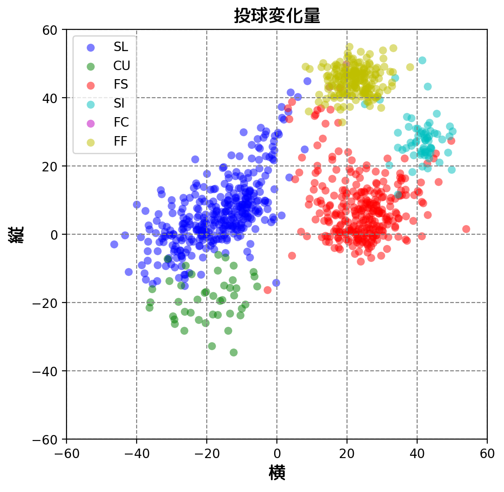

```python
import pandas as pd
import os
import matplotlib.pyplot as plt
from matplotlib import font_manager
import matplotlib as mpl
import numpy as np
import random
from matplotlib import colors as mcolors


# 一度きりならこの方法で
rc = lambda: random.randint(0, 255)
print('#{:x}{:x}{:x}'.format(rc(), rc(), rc()))  # => #bd9f7b など（英字は小文字）
print('#{:X}{:X}{:X}'.format(rc(), rc(), rc()))  # => #BD9F7B など（英字は大文字）

# 何度も色を生成したいなら関数化
def generate_random_color():
    return '#{:x}{:x}{:x}'.format(*[random.randint(0, 255) for _ in range(3)])


font_dir = '/usr/share/fonts/truetype/'
font_path = os.path.join(font_dir,'rounded-mgenplus-1m-medium.ttf')
font = font_manager.FontProperties(fname=font_path,size=14)

# index_col which column
df = pd.read_csv('tanaka.csv',parse_dates=['game_date'])
df.head()
```

    #86a6dd
    #736DC2


<div>
<style scoped>
    .dataframe tbody tr th:only-of-type {
        vertical-align: middle;
    }

    .dataframe tbody tr th {
        vertical-align: top;
    }

    .dataframe thead th {
        text-align: right;
    }
</style>
<table border="1" class="dataframe">
  <thead>
    <tr style="text-align: right;">
      <th></th>
      <th>pitch_type</th>
      <th>game_date</th>
      <th>release_speed</th>
      <th>release_pos_x</th>
      <th>release_pos_z</th>
      <th>player_name</th>
      <th>batter</th>
      <th>pitcher</th>
      <th>events</th>
      <th>description</th>
      <th>...</th>
      <th>home_score</th>
      <th>away_score</th>
      <th>bat_score</th>
      <th>fld_score</th>
      <th>post_away_score</th>
      <th>post_home_score</th>
      <th>post_bat_score</th>
      <th>post_fld_score</th>
      <th>if_fielding_alignment</th>
      <th>of_fielding_alignment</th>
    </tr>
  </thead>
  <tbody>
    <tr>
      <th>0</th>
      <td>FS</td>
      <td>2018-05-27</td>
      <td>83.6</td>
      <td>-2.3570</td>
      <td>5.1555</td>
      <td>Masahiro Tanaka</td>
      <td>472528</td>
      <td>547888</td>
      <td>field_out</td>
      <td>hit_into_play</td>
      <td>...</td>
      <td>3</td>
      <td>1</td>
      <td>1</td>
      <td>3</td>
      <td>1</td>
      <td>3</td>
      <td>1</td>
      <td>3</td>
      <td>Infield shift</td>
      <td>Standard</td>
    </tr>
    <tr>
      <th>1</th>
      <td>FS</td>
      <td>2018-05-27</td>
      <td>88.7</td>
      <td>-2.1560</td>
      <td>5.3479</td>
      <td>Masahiro Tanaka</td>
      <td>660271</td>
      <td>547888</td>
      <td>strikeout</td>
      <td>swinging_strike</td>
      <td>...</td>
      <td>3</td>
      <td>1</td>
      <td>1</td>
      <td>3</td>
      <td>1</td>
      <td>3</td>
      <td>1</td>
      <td>3</td>
      <td>Infield shift</td>
      <td>Standard</td>
    </tr>
    <tr>
      <th>2</th>
      <td>FF</td>
      <td>2018-05-27</td>
      <td>93.0</td>
      <td>-2.3180</td>
      <td>5.0929</td>
      <td>Masahiro Tanaka</td>
      <td>660271</td>
      <td>547888</td>
      <td>NaN</td>
      <td>called_strike</td>
      <td>...</td>
      <td>3</td>
      <td>1</td>
      <td>1</td>
      <td>3</td>
      <td>1</td>
      <td>3</td>
      <td>1</td>
      <td>3</td>
      <td>Infield shift</td>
      <td>Standard</td>
    </tr>
    <tr>
      <th>3</th>
      <td>SL</td>
      <td>2018-05-27</td>
      <td>82.9</td>
      <td>-2.4380</td>
      <td>5.2115</td>
      <td>Masahiro Tanaka</td>
      <td>660271</td>
      <td>547888</td>
      <td>NaN</td>
      <td>foul_tip</td>
      <td>...</td>
      <td>3</td>
      <td>1</td>
      <td>1</td>
      <td>3</td>
      <td>1</td>
      <td>3</td>
      <td>1</td>
      <td>3</td>
      <td>Infield shift</td>
      <td>Standard</td>
    </tr>
    <tr>
      <th>4</th>
      <td>FF</td>
      <td>2018-05-27</td>
      <td>93.1</td>
      <td>-2.2573</td>
      <td>5.1658</td>
      <td>Masahiro Tanaka</td>
      <td>660271</td>
      <td>547888</td>
      <td>NaN</td>
      <td>ball</td>
      <td>...</td>
      <td>3</td>
      <td>1</td>
      <td>1</td>
      <td>3</td>
      <td>1</td>
      <td>3</td>
      <td>1</td>
      <td>3</td>
      <td>Infield shift</td>
      <td>Standard</td>
    </tr>
  </tbody>
</table>
<p>5 rows × 89 columns</p>
</div>


```python
generate_random_color()  # => #EF2F5B など
```


    '#8af26e'


```python
print(set(df['pitch_type']))
```

    {nan, 'SL', 'CU', 'FS', 'SI', 'FC', 'FF'}


```python
# drop 942,941
df = df.drop([941,942])
```


```python
colors = dict(mcolors.BASE_COLORS, **mcolors.CSS4_COLORS)
print(colors)
```

    {'b': (0, 0, 1), 'g': (0, 0.5, 0), 'r': (1, 0, 0), 'c': (0, 0.75, 0.75), 'm': (0.75, 0, 0.75), 'y': (0.75, 0.75, 0), 'k': (0, 0, 0), 'w': (1, 1, 1), 'aliceblue': '#F0F8FF', 'antiquewhite': '#FAEBD7', 'aqua': '#00FFFF', 'aquamarine': '#7FFFD4', 'azure': '#F0FFFF', 'beige': '#F5F5DC', 'bisque': '#FFE4C4', 'black': '#000000', 'blanchedalmond': '#FFEBCD', 'blue': '#0000FF', 'blueviolet': '#8A2BE2', 'brown': '#A52A2A', 'burlywood': '#DEB887', 'cadetblue': '#5F9EA0', 'chartreuse': '#7FFF00', 'chocolate': '#D2691E', 'coral': '#FF7F50', 'cornflowerblue': '#6495ED', 'cornsilk': '#FFF8DC', 'crimson': '#DC143C', 'cyan': '#00FFFF', 'darkblue': '#00008B', 'darkcyan': '#008B8B', 'darkgoldenrod': '#B8860B', 'darkgray': '#A9A9A9', 'darkgreen': '#006400', 'darkgrey': '#A9A9A9', 'darkkhaki': '#BDB76B', 'darkmagenta': '#8B008B', 'darkolivegreen': '#556B2F', 'darkorange': '#FF8C00', 'darkorchid': '#9932CC', 'darkred': '#8B0000', 'darksalmon': '#E9967A', 'darkseagreen': '#8FBC8F', 'darkslateblue': '#483D8B', 'darkslategray': '#2F4F4F', 'darkslategrey': '#2F4F4F', 'darkturquoise': '#00CED1', 'darkviolet': '#9400D3', 'deeppink': '#FF1493', 'deepskyblue': '#00BFFF', 'dimgray': '#696969', 'dimgrey': '#696969', 'dodgerblue': '#1E90FF', 'firebrick': '#B22222', 'floralwhite': '#FFFAF0', 'forestgreen': '#228B22', 'fuchsia': '#FF00FF', 'gainsboro': '#DCDCDC', 'ghostwhite': '#F8F8FF', 'gold': '#FFD700', 'goldenrod': '#DAA520', 'gray': '#808080', 'green': '#008000', 'greenyellow': '#ADFF2F', 'grey': '#808080', 'honeydew': '#F0FFF0', 'hotpink': '#FF69B4', 'indianred': '#CD5C5C', 'indigo': '#4B0082', 'ivory': '#FFFFF0', 'khaki': '#F0E68C', 'lavender': '#E6E6FA', 'lavenderblush': '#FFF0F5', 'lawngreen': '#7CFC00', 'lemonchiffon': '#FFFACD', 'lightblue': '#ADD8E6', 'lightcoral': '#F08080', 'lightcyan': '#E0FFFF', 'lightgoldenrodyellow': '#FAFAD2', 'lightgray': '#D3D3D3', 'lightgreen': '#90EE90', 'lightgrey': '#D3D3D3', 'lightpink': '#FFB6C1', 'lightsalmon': '#FFA07A', 'lightseagreen': '#20B2AA', 'lightskyblue': '#87CEFA', 'lightslategray': '#778899', 'lightslategrey': '#778899', 'lightsteelblue': '#B0C4DE', 'lightyellow': '#FFFFE0', 'lime': '#00FF00', 'limegreen': '#32CD32', 'linen': '#FAF0E6', 'magenta': '#FF00FF', 'maroon': '#800000', 'mediumaquamarine': '#66CDAA', 'mediumblue': '#0000CD', 'mediumorchid': '#BA55D3', 'mediumpurple': '#9370DB', 'mediumseagreen': '#3CB371', 'mediumslateblue': '#7B68EE', 'mediumspringgreen': '#00FA9A', 'mediumturquoise': '#48D1CC', 'mediumvioletred': '#C71585', 'midnightblue': '#191970', 'mintcream': '#F5FFFA', 'mistyrose': '#FFE4E1', 'moccasin': '#FFE4B5', 'navajowhite': '#FFDEAD', 'navy': '#000080', 'oldlace': '#FDF5E6', 'olive': '#808000', 'olivedrab': '#6B8E23', 'orange': '#FFA500', 'orangered': '#FF4500', 'orchid': '#DA70D6', 'palegoldenrod': '#EEE8AA', 'palegreen': '#98FB98', 'paleturquoise': '#AFEEEE', 'palevioletred': '#DB7093', 'papayawhip': '#FFEFD5', 'peachpuff': '#FFDAB9', 'peru': '#CD853F', 'pink': '#FFC0CB', 'plum': '#DDA0DD', 'powderblue': '#B0E0E6', 'purple': '#800080', 'rebeccapurple': '#663399', 'red': '#FF0000', 'rosybrown': '#BC8F8F', 'royalblue': '#4169E1', 'saddlebrown': '#8B4513', 'salmon': '#FA8072', 'sandybrown': '#F4A460', 'seagreen': '#2E8B57', 'seashell': '#FFF5EE', 'sienna': '#A0522D', 'silver': '#C0C0C0', 'skyblue': '#87CEEB', 'slateblue': '#6A5ACD', 'slategray': '#708090', 'slategrey': '#708090', 'snow': '#FFFAFA', 'springgreen': '#00FF7F', 'steelblue': '#4682B4', 'tan': '#D2B48C', 'teal': '#008080', 'thistle': '#D8BFD8', 'tomato': '#FF6347', 'turquoise': '#40E0D0', 'violet': '#EE82EE', 'wheat': '#F5DEB3', 'white': '#FFFFFF', 'whitesmoke': '#F5F5F5', 'yellow': '#FFFF00', 'yellowgreen': '#9ACD32'}


```python
df.tail()
```


<div>
<style scoped>
    .dataframe tbody tr th:only-of-type {
        vertical-align: middle;
    }

    .dataframe tbody tr th {
        vertical-align: top;
    }

    .dataframe thead th {
        text-align: right;
    }
</style>
<table border="1" class="dataframe">
  <thead>
    <tr style="text-align: right;">
      <th></th>
      <th>pitch_type</th>
      <th>game_date</th>
      <th>release_speed</th>
      <th>release_pos_x</th>
      <th>release_pos_z</th>
      <th>player_name</th>
      <th>batter</th>
      <th>pitcher</th>
      <th>events</th>
      <th>description</th>
      <th>...</th>
      <th>home_score</th>
      <th>away_score</th>
      <th>bat_score</th>
      <th>fld_score</th>
      <th>post_away_score</th>
      <th>post_home_score</th>
      <th>post_bat_score</th>
      <th>post_fld_score</th>
      <th>if_fielding_alignment</th>
      <th>of_fielding_alignment</th>
    </tr>
  </thead>
  <tbody>
    <tr>
      <th>936</th>
      <td>FS</td>
      <td>2018-03-30</td>
      <td>86.1</td>
      <td>-1.3680</td>
      <td>5.3995</td>
      <td>Masahiro Tanaka</td>
      <td>475253</td>
      <td>547888</td>
      <td>double</td>
      <td>hit_into_play_no_out</td>
      <td>...</td>
      <td>0</td>
      <td>0</td>
      <td>0</td>
      <td>0</td>
      <td>0</td>
      <td>0</td>
      <td>0</td>
      <td>0</td>
      <td>Infield shift</td>
      <td>Standard</td>
    </tr>
    <tr>
      <th>937</th>
      <td>FF</td>
      <td>2018-03-30</td>
      <td>92.3</td>
      <td>-1.3189</td>
      <td>5.3858</td>
      <td>Masahiro Tanaka</td>
      <td>475253</td>
      <td>547888</td>
      <td>NaN</td>
      <td>called_strike</td>
      <td>...</td>
      <td>0</td>
      <td>0</td>
      <td>0</td>
      <td>0</td>
      <td>0</td>
      <td>0</td>
      <td>0</td>
      <td>0</td>
      <td>Infield shift</td>
      <td>Standard</td>
    </tr>
    <tr>
      <th>938</th>
      <td>SL</td>
      <td>2018-03-30</td>
      <td>84.5</td>
      <td>-1.4882</td>
      <td>5.3108</td>
      <td>Masahiro Tanaka</td>
      <td>518626</td>
      <td>547888</td>
      <td>strikeout</td>
      <td>swinging_strike</td>
      <td>...</td>
      <td>0</td>
      <td>0</td>
      <td>0</td>
      <td>0</td>
      <td>0</td>
      <td>0</td>
      <td>0</td>
      <td>0</td>
      <td>Standard</td>
      <td>Strategic</td>
    </tr>
    <tr>
      <th>939</th>
      <td>FF</td>
      <td>2018-03-30</td>
      <td>91.3</td>
      <td>-1.3678</td>
      <td>5.4476</td>
      <td>Masahiro Tanaka</td>
      <td>518626</td>
      <td>547888</td>
      <td>NaN</td>
      <td>ball</td>
      <td>...</td>
      <td>0</td>
      <td>0</td>
      <td>0</td>
      <td>0</td>
      <td>0</td>
      <td>0</td>
      <td>0</td>
      <td>0</td>
      <td>Standard</td>
      <td>Strategic</td>
    </tr>
    <tr>
      <th>940</th>
      <td>FF</td>
      <td>2018-03-30</td>
      <td>92.3</td>
      <td>-1.2605</td>
      <td>5.3815</td>
      <td>Masahiro Tanaka</td>
      <td>518626</td>
      <td>547888</td>
      <td>NaN</td>
      <td>called_strike</td>
      <td>...</td>
      <td>0</td>
      <td>0</td>
      <td>0</td>
      <td>0</td>
      <td>0</td>
      <td>0</td>
      <td>0</td>
      <td>0</td>
      <td>Strategic</td>
      <td>Strategic</td>
    </tr>
  </tbody>
</table>
<p>5 rows × 89 columns</p>
</div>


```python
set(df['pitch_type'])
pitch_type = set(df['pitch_type'])
print(pitch_type)
pitch_type_color = dict()
colorlist = ["0.1", "0.2", "0.3", "0.4", "0.5", "0.6", "0.7", "0.8", "0.9", "1.0"]
for i,j in zip(pitch_type,colors):
    pitch_type_color[i] = colors[j]
print(pitch_type_color)
def inverse(x):
    return x*(-1)
def ft_cm(x):
    return x * 30.48

```

    {'SL', 'CU', 'FS', 'SI', 'FC', 'FF'}
    {'SL': (0, 0, 1), 'CU': (0, 0.5, 0), 'FS': (1, 0, 0), 'SI': (0, 0.75, 0.75), 'FC': (0.75, 0, 0.75), 'FF': (0.75, 0.75, 0)}


```python
%matplotlib inline
# the canvas
fig = plt.figure(figsize=(6,6),dpi=200)
# fig = plt.figure()
plt.rcParams['axes.xmargin'] = 0
ax = fig.add_subplot(111)
ax.set_title('投球変化量',fontproperties=font)
ax.set_xlabel('横',fontproperties=font)
ax.set_ylabel('縦',fontproperties=font)
ax.grid(color='gray',linestyle='--')
ax.set_xlim((-60,60))
ax.set_ylim((-60,60))
plt.xticks(np.arange(-60,61,step=20))
# ax.annotate('FF', xy=(30, 43), xytext=(40, 50),arrowprops=dict(shrink=0.1))
# ax.annotate('FS', xy=(30, -8), xytext=(40, -20),arrowprops=dict(shrink=0.1))
# ax.annotate('SL', xy=(-40, 20), xytext=(-55, 30),arrowprops=dict(shrink=0.1))
# ax.annotate('CU', xy=(-40, -40), xytext=(-50, -50),arrowprops=dict(shrink=0.1))

for pt in pitch_type_color:
    tmp = df[df['pitch_type'] == pt]
    cl = pitch_type_color[pt]
    print(cl)
    p=ax.scatter(tmp['pfx_x'].apply(ft_cm).apply(inverse),tmp['pfx_z'].apply(ft_cm),s=40,c=cl,alpha=0.5,linewidth=0,label=pt)


# ax_sc.patch.set_facecolor('gray')
ax.patch.set_alpha(0.1) 
# plt.xticks(index,dates, fontsize=10, rotation=30)
# ax.xaxis.set_major_formatter(DateFormatter('%m/%d'))


ax.legend()
fig.show()
plt.savefig('tanaka_mov.png') # -----(2)
```

    (0, 0, 1)
    (0, 0.5, 0)
    (1, 0, 0)
    (0, 0.75, 0.75)
    (0.75, 0, 0.75)
    (0.75, 0.75, 0)


    /home/zhou/.pyenv/versions/3.6.3/envs/scraping/lib/python3.6/site-packages/matplotlib/figure.py:418: UserWarning: matplotlib is currently using a non-GUI backend, so cannot show the figure
      "matplotlib is currently using a non-GUI backend, "
    /home/zhou/.pyenv/versions/3.6.3/envs/scraping/lib/python3.6/site-packages/matplotlib/font_manager.py:1316: UserWarning: findfont: Font family ['rounded-mgenplus-1m-medium'] not found. Falling back to DejaVu Sans
      (prop.get_family(), self.defaultFamily[fontext]))




